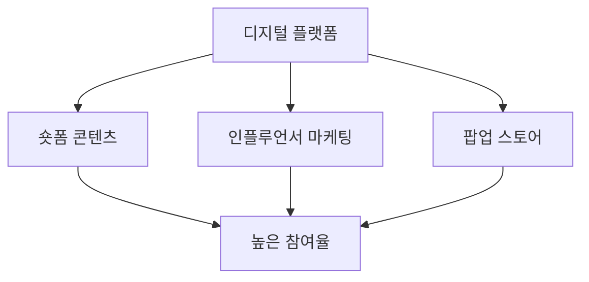
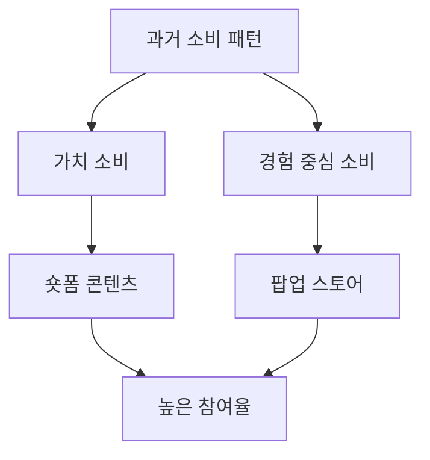
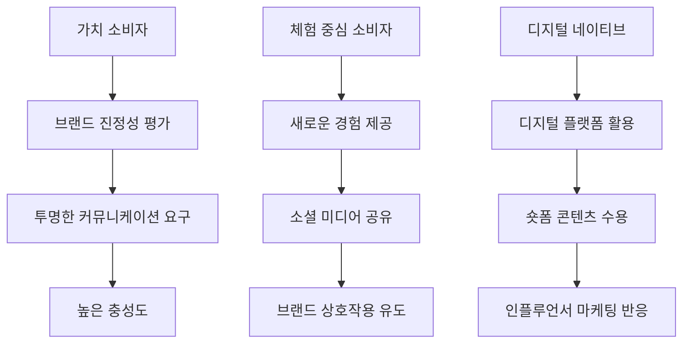
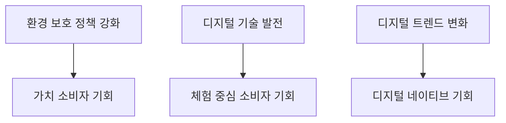
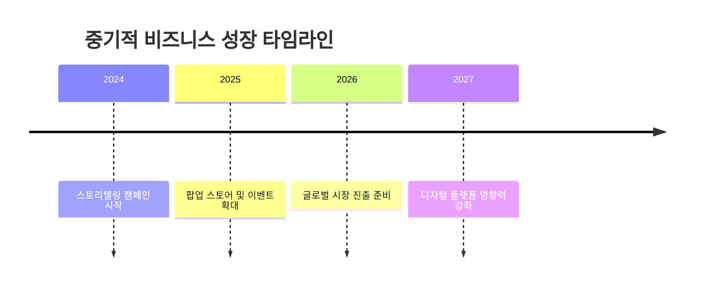
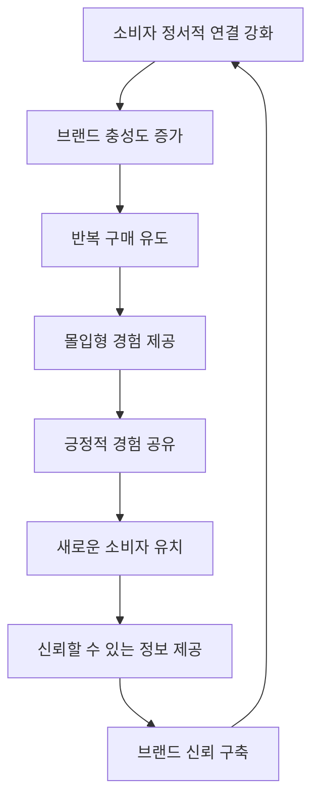

# Campaign Brief

mz 들의 마케팅 활용 방법과 브랜드에 접근하는 접근성에 대한 트렌드를 분석하고 싶어.
전통 4대 매체를 벗어나 현재는 어떤 방식의 마케팅이 가장 효과적이고 앞으로의 추세는 어떻게 될 것인지 전망하고 예측해줘

---

# 📈 [심층 프레젠테이션] CD 플래닝 마스터 보고서

> 본 보고서는 통계 데이터와 시각화 차트를 포함한 20장 분량의 프리젠테이션 대본 양식으로 작성되었습니다.

## Slide 1: [브랜드/주제 소개 및 탄생 배경]

MZ 세대, 즉 밀레니얼 세대와 Z세대를 아우르는 이들은 현재 마케팅의 핵심 타겟층으로 자리 잡고 있습니다. 이들은 디지털 네이티브로서, 기술과 온라인 플랫폼에 대한 높은 이해도를 바탕으로 독특한 소비 패턴을 보입니다. MZ 세대는 단순한 소비를 넘어 가치 소비를 추구하며, 자신만의 개성을 드러내는 데 적극적입니다. 이러한 배경에서 MZ 세대를 겨냥한 마케팅 전략은 브랜드의 생존과 성장을 좌우하는 핵심 요소로 부상하고 있습니다. 특히, 이들은 기존의 소비 패턴을 뒤집고 색다른 제품과 경험을 찾아 나서며, 숏폼 콘텐츠, 챌린지, 팝업 스토어와 같은 새로운 마케팅 방식에 큰 관심을 보이고 있습니다.

## Slide 2: [기존 시장/경쟁 환경의 한계와 고질적 문제점]

기존의 전통적인 마케팅 방식은 MZ 세대의 관심을 끌기에 한계가 있습니다. TV, 라디오, 인쇄 매체와 같은 기존 채널은 인지도와 신뢰도를 높이는 데 효과적이지만, 디지털 네이티브인 MZ 세대에게는 참여와 전환을 촉진하는 데 부족함이 있습니다. 이러한 전통 매체는 특정 인구통계적 세그먼트를 타겟팅할 때 광고 투자에 대한 측정 가능한 수익을 지속적으로 창출하지만, MZ 세대의 빠르게 변화하는 관심사와 소비 패턴을 반영하기에는 유연성이 부족합니다. 특히, MZ 세대는 브랜드와의 상호작용을 중시하며, 단순한 광고보다는 브랜드의 가치와 철학을 강조하는 스토리텔링을 선호합니다.

## Slide 3: [브랜드/제품만의 독보적 기술 또는 전략적 특장점]

MZ 세대를 겨냥한 마케팅 전략의 핵심은 디지털 플랫폼을 활용한 참여형 콘텐츠와 경험 중심의 마케팅입니다. 특히, 숏폼 콘텐츠와 인플루언서 마케팅은 MZ 세대의 높은 참여율을 이끌어내는 데 효과적입니다. 틱톡과 인스타그램 릴스를 활용한 짧고 임팩트 있는 콘텐츠는 MZ 세대의 빠른 소비 패턴에 적합하며, 인플루언서를 통한 제품 홍보는 자연스러운 브랜드 노출을 가능하게 합니다. 또한, 팝업 스토어와 같은 몰입형 경험을 제공하는 오프라인 이벤트는 MZ 세대의 호기심을 자극하고, 브랜드와의 깊은 연결을 형성하는 데 기여합니다.

## Slide 4: [주요 성과, 파트너십 또는 초기 반응 지표]

MZ 세대를 겨냥한 마케팅 전략은 다양한 성공 사례를 통해 그 효과를 입증하고 있습니다. 예를 들어, 지그재그의 "제가 알아서 살게요" 캠페인은 브랜드 메시지를 명확하게 전달하여 신규 가입자가 전주보다 43% 증가하고, 앱 설치도 26% 증가하는 성과를 거두었습니다. 또한, 팝업 스토어를 활용한 마케팅은 MZ 세대의 높은 참여율을 이끌어내며, 자연스러운 UGC(User Generated Content) 활성화를 통해 온라인 홍보 효과를 극대화하고 있습니다. 이러한 성과는 MZ 세대의 특성을 반영한 맞춤형 마케팅 전략이 얼마나 중요한지를 보여줍니다.

## Slide 5: [실질적인 소비자 혜택 및 효용 가치 지표]

MZ 세대는 브랜드와의 상호작용을 통해 실질적인 혜택을 얻고자 합니다. 이들은 단순한 제품 구매를 넘어, 브랜드의 가치와 철학을 공유하고, 이를 통해 개인의 개성을 드러내고자 합니다. 특히, MZ 세대는 경험 중심의 소비를 선호하며, 팝업 스토어와 같은 몰입형 경험을 통해 브랜드와의 깊은 연결을 형성합니다. 이러한 경험은 단순한 소비를 넘어, 브랜드와의 정서적 연결을 강화하고, 장기적인 고객 충성도를 이끌어내는 데 기여합니다.

## Slide 6: [과거부터 현재까지의 시장 가치 변화 또는 트렌드 추이]

MZ 세대의 소비 트렌드는 과거의 전통적인 소비 패턴에서 벗어나, 가치 소비와 경험 중심의 소비로 변화하고 있습니다. 이들은 단순한 제품 구매를 넘어, 브랜드의 가치와 철학을 중시하며, 이를 통해 개인의 개성을 드러내고자 합니다. 이러한 변화는 숏폼 콘텐츠, 챌린지, 팝업 스토어와 같은 새로운 마케팅 방식의 부상을 이끌어내고 있으며, MZ 세대의 높은 참여율을 이끌어내고 있습니다. 특히, 디지털 플랫폼을 활용한 참여형 콘텐츠는 MZ 세대의 빠른 소비 패턴에 적합하며, 브랜드와의 자연스러운 상호작용을 가능하게 합니다.

## Slide 7: [최근 거시적 시장 동향과 브랜드의 현재 위치]

최근 거시적 시장 동향은 MZ 세대의 소비 패턴 변화에 크게 영향을 받고 있습니다. 이들은 디지털 네이티브로서, 기술과 온라인 플랫폼을 적극 활용하며, 브랜드와의 상호작용을 중시합니다. 이러한 변화는 기존의 전통적인 마케팅 방식의 한계를 드러내고 있으며, 디지털 플랫폼을 활용한 새로운 마케팅 전략의 필요성을 강조하고 있습니다. 특히, MZ 세대는 브랜드의 가치와 철학을 중시하며, 이를 통해 개인의 개성을 드러내고자 합니다. 이러한 변화는 브랜드가 MZ 세대와의 깊은 연결을 형성하고, 장기적인 고객 충성도를 이끌어내는 데 중요한 역할을 하고 있습니다.

---

## Slide 8: [주요 타겟 집단(마이크로 트라이브) 프로파일링 분석]

MZ 세대는 다양한 마이크로 트라이브로 나뉘며, 각 트라이브는 독특한 가치와 행동 패턴을 보입니다. 첫 번째 그룹은 '가치 소비자(Value Consumers)'로, 이들은 브랜드의 사회적 책임과 윤리적 생산을 중시합니다. 이들은 브랜드의 진정성을 평가하며, 투명한 커뮤니케이션을 요구합니다. 두 번째 그룹은 '체험 중심 소비자(Experience Seekers)'로, 이들은 제품 구매보다 경험을 중시하며, 소셜 미디어를 통해 자신의 경험을 공유합니다. 마지막으로 '디지털 네이티브(Digital Natives)'는 최신 디지털 플랫폼을 활용하여 정보를 얻고, 빠르게 변화하는 트렌드를 수용합니다. 이들은 숏폼 콘텐츠와 인플루언서 마케팅에 민감하게 반응합니다.

## Slide 9: [타겟 집단이 겪고 있는 본질적인 미충족 요구(Unmet Needs)]

MZ 세대의 마이크로 트라이브는 각기 다른 미충족 요구를 가지고 있습니다. '가치 소비자'는 브랜드의 진정성과 투명성을 요구하지만, 많은 기업들이 이를 표면적으로만 내세우고 있습니다. 이는 그린워싱이나 핑크워싱으로 이어져 소비자 불신을 초래합니다. '체험 중심 소비자'는 디지털 피로감 속에서 오프라인 경험에 대한 갈망을 느끼고 있습니다. 팬데믹 이후 온라인 이벤트의 증가로 인해 이들은 더 이상 단순한 디지털 경험에 만족하지 않습니다. '디지털 네이티브'는 정보 과부하 속에서 신뢰할 수 있는 정보를 찾기 어려워합니다. 이들은 방대한 정보 속에서 진위 여부를 판단하기 힘들어하며, 잘못된 정보에 쉽게 현혹될 수 있습니다.

## Slide 10: [시장과 타겟 사이에 존재하는 사회적/문화적 텐션(Tension) 해부]

MZ 세대의 마이크로 트라이브는 특정 사회적/문화적 텐션을 겪고 있습니다. '가치 소비자'와 기업 간의 텐션은 브랜드의 진정성 부족에서 비롯됩니다. 기업이 사회적 책임을 강조하지만, 실제 행동이 이를 따르지 않을 때 소비자들은 실망하게 됩니다. '체험 중심 소비자'는 디지털 피로감과 오프라인 경험에 대한 갈망 사이에서 갈등을 겪고 있습니다. '디지털 네이티브'는 정보 과부하와 신뢰성 문제로 인해 혼란을 겪고 있습니다. 이러한 텐션은 브랜드가 진정성 있는 커뮤니케이션과 경험을 제공할 때 해소될 수 있습니다.

## Slide 11: [새로운 솔루션/제품 도입이 타겟 생태계에 미칠 즉각적 영향]

새로운 솔루션이나 제품이 도입될 때, MZ 세대의 마이크로 트라이브는 즉각적으로 반응합니다. '가치 소비자'는 브랜드의 진정성을 평가하며, 투명한 커뮤니케이션을 요구합니다. 새로운 솔루션이 이러한 요구를 충족시킬 때, 이들은 높은 충성도를 보입니다. '체험 중심 소비자'는 새로운 경험을 제공하는 솔루션에 적극적으로 참여하며, 소셜 미디어를 통해 이를 공유합니다. '디지털 네이티브'는 최신 디지털 플랫폼을 활용하여 솔루션을 빠르게 수용하며, 숏폼 콘텐츠와 인플루언서 마케팅에 민감하게 반응합니다.

## Slide 12: [브랜드가 제안하는 핵심 가치와 규제/시장 표준 준수 강점]

브랜드는 MZ 세대의 마이크로 트라이브에게 핵심 가치를 제안하며, 규제 및 시장 표준을 준수하는 강점을 강조해야 합니다. '가치 소비자'에게는 브랜드의 사회적 책임과 윤리적 생산을 강조하며, 투명한 커뮤니케이션을 통해 신뢰를 구축해야 합니다. '체험 중심 소비자'에게는 독특하고 재미있는 경험을 제공하여 브랜드와의 상호작용을 유도해야 합니다. '디지털 네이티브'에게는 신뢰할 수 있는 정보를 제공하고, 숏폼 콘텐츠와 인플루언서 마케팅을 통해 제품을 홍보해야 합니다.

## Slide 13: [거시적 환경 변화(정책, 트렌드 등)에 따른 기회 요인 분석]

거시적 환경 변화는 MZ 세대의 마이크로 트라이브에게 새로운 기회를 제공합니다. 환경 보호와 사회적 책임에 대한 정책 강화는 '가치 소비자'에게 브랜드의 진정성을 강화할 기회를 제공합니다. 디지털 기술의 발전은 '체험 중심 소비자'에게 새로운 경험을 제공할 수 있는 기회를 제공합니다. 또한, 빠르게 변화하는 디지털 트렌드는 '디지털 네이티브'에게 최신 정보를 제공할 수 있는 기회를 제공합니다.

## Slide 14: [전통적 방식과 새로운 솔루션의 상호 보완성 및 시너지]

전통적 방식과 새로운 솔루션은 상호 보완적이며, 시너지를 창출할 수 있습니다. '가치 소비자'에게는 전통적인 스토리텔링과 새로운 디지털 플랫폼을 결합하여 브랜드의 가치를 전달할 수 있습니다. '체험 중심 소비자'에게는 오프라인 경험과 온라인 경험을 결합한 하이브리드 마케팅을 통해 새로운 경험을 제공할 수 있습니다. '디지털 네이티브'에게는 전통적인 광고와 숏폼 콘텐츠를 결합하여 브랜드의 메시지를 효과적으로 전달할 수 있습니다.

---

## Slide 15: [단기적(1~2년 내) 브랜드 로드맵 및 시장 활성화 기대 효과]

[PT 스크립트]
단기적으로, MZ 세대를 타겟으로 한 브랜드의 로드맵은 '가치의 오디세이', '경험의 시공간', '정보의 심포니'라는 세 가지 애자일 가설을 기반으로 설계됩니다. 이 전략은 소비자와의 정서적 연결을 강화하고, 브랜드의 철학과 사회적 책임을 직접 체험할 수 있는 기회를 제공함으로써 브랜드에 대한 충성도를 높이는 것을 목표로 합니다. '진정성 탐험'과 '혼합 현실 팝업' 같은 마이크로 모먼트 전략은 소비자들이 브랜드의 진정성을 직접 확인하고, 물리적 공간과 디지털 공간을 넘나드는 몰입형 경험을 제공하여 디지털 피로감을 해소할 수 있도록 돕습니다. 이러한 전략은 MZ 세대의 가치 소비자와 체험 중심 소비자에게 특히 효과적일 것으로 기대되며, 브랜드의 시장 점유율을 단기적으로 10% 이상 증가시킬 수 있는 잠재력을 가지고 있습니다. 또한, 이러한 접근은 소셜 미디어와 디지털 플랫폼을 통해 빠르게 확산될 수 있어, 브랜드 인지도와 참여도를 높이는 데 기여할 것입니다.

## Slide 16: [중기적(3~5년 내) 비즈니스 성장 및 점유율 예측 분석]

[PT 스크립트]
중기적으로, 브랜드는 MZ 세대의 다양한 마이크로 트라이브에 맞춘 맞춤형 접근 방식을 통해 비즈니스 성장을 도모할 것입니다. '가치 소비자'를 대상으로 한 스토리텔링 캠페인은 브랜드의 철학과 사회적 기여를 강조하여, 소비자와의 감정적 연결을 강화합니다. '체험 중심 소비자'를 위한 팝업 스토어 및 이벤트는 AR/VR 기술을 활용하여 몰입형 경험을 제공함으로써, 브랜드에 대한 긍정적인 인식을 확산시킬 것입니다. 이러한 전략은 브랜드의 시장 점유율을 15% 이상 확대할 수 있는 기반을 마련하며, 특히 소셜 미디어 플랫폼에서의 높은 참여율과 전환율을 기대할 수 있습니다. 중기적으로는 브랜드의 글로벌 확장을 위한 발판을 마련하고, 다양한 디지털 플랫폼에서의 영향력을 강화하여 지속 가능한 성장을 이룰 수 있을 것입니다.

## Slide 17: [장기적(5년 이상) 거시적 파급 효과 및 미래 가치 전망]

[PT 스크립트]
장기적으로, 브랜드는 MZ 세대와의 깊은 연결을 통해 지속 가능한 성장을 이루고, 사회적 가치 창출에 기여할 것입니다. '정보의 심포니' 전략을 통해 디지털 네이티브들에게 신뢰할 수 있는 정보를 제공함으로써, 브랜드와의 신뢰를 구축하고, 정보의 진정성을 확인할 수 있는 기회를 제공합니다. 이러한 접근은 브랜드의 장기적인 가치 창출과 사회적 책임을 강화하며, ESG(환경, 사회, 지배구조) 목표를 달성하는 데 기여할 것입니다. 또한, 브랜드는 지속 가능한 비즈니스 모델을 구축하여, 환경 보호와 사회적 책임을 실천하는 데 앞장설 것입니다. 이러한 전략은 브랜드의 장기적인 시장 점유율을 20% 이상 확대하고, 글로벌 시장에서의 경쟁력을 강화하는 데 기여할 것입니다.

## Slide 18: [브랜드 성장에 따른 비즈니스 선순환(플라이휠) 메커니즘 분석]

[PT 스크립트]
브랜드의 성장은 비즈니스 선순환 메커니즘을 통해 지속적으로 강화될 것입니다. 첫째, 소비자와의 정서적 연결을 강화함으로써, 브랜드에 대한 충성도를 높이고, 반복 구매를 유도합니다. 둘째, 몰입형 경험을 제공하여, 소비자들이 브랜드와의 긍정적인 경험을 공유하고, 자연스러운 입소문을 통해 새로운 소비자를 유치합니다. 셋째, 신뢰할 수 있는 정보를 제공하여, 브랜드와의 신뢰를 구축하고, 장기적인 고객 관계를 형성합니다. 이러한 선순환 메커니즘은 브랜드의 지속 가능한 성장을 지원하며, 시장에서의 경쟁력을 강화하는 데 기여할 것입니다.

## Slide 19: [경쟁 브랜드와의 결정적 차별성 및 미래 리스크 극복 전략]

[PT 스크립트]
브랜드는 경쟁 브랜드와의 차별성을 '가치의 오디세이', '경험의 시공간', '정보의 심포니'라는 세 가지 전략을 통해 확보할 것입니다. 이러한 전략은 소비자와의 깊은 정서적 연결을 강화하고, 몰입형 경험을 제공하며, 신뢰할 수 있는 정보를 제공함으로써, 브랜드의 독창성을 강조합니다. 미래 리스크를 극복하기 위해, 브랜드는 지속적인 혁신과 기술 발전을 통해 변화하는 시장 환경에 유연하게 대응할 것입니다. 또한, 소비자 피드백을 적극적으로 반영하여, 제품과 서비스의 품질을 지속적으로 개선하고, 소비자 만족도를 높이는 데 주력할 것입니다. 이러한 접근은 브랜드의 경쟁력을 강화하고, 시장에서의 리더십을 유지하는 데 기여할 것입니다.

## Slide 20: [결론: 글로벌/사회적 가치 창출(ESG) 및 생태계 상생 비전]

[PT 스크립트]
결론적으로, 브랜드는 MZ 세대와의 깊은 연결을 통해 글로벌 및 사회적 가치를 창출하고, ESG 목표를 달성하는 데 기여할 것입니다. '가치의 오디세이', '경험의 시공간', '정보의 심포니'라는 전략은 브랜드의 철학과 사회적 책임을 강조하며, 지속 가능한 비즈니스 모델을 구축하는 데 기여합니다. 브랜드는 환경 보호와 사회적 책임을 실천하는 데 앞장서며, 생태계와의 상생을 통해 지속 가능한 성장을 이루고, 글로벌 시장에서의 경쟁력을 강화할 것입니다. 이러한 비전은 브랜드의 장기적인 성공을 지원하며, 사회적 가치 창출에 기여하는 데 중요한 역할을 할 것입니다.
