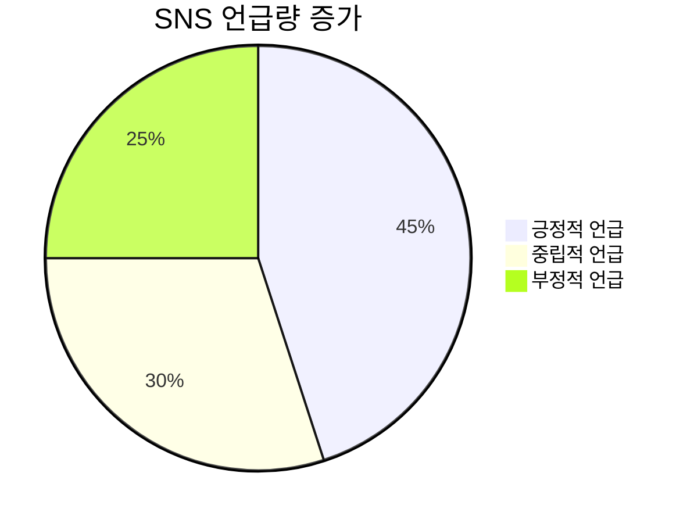
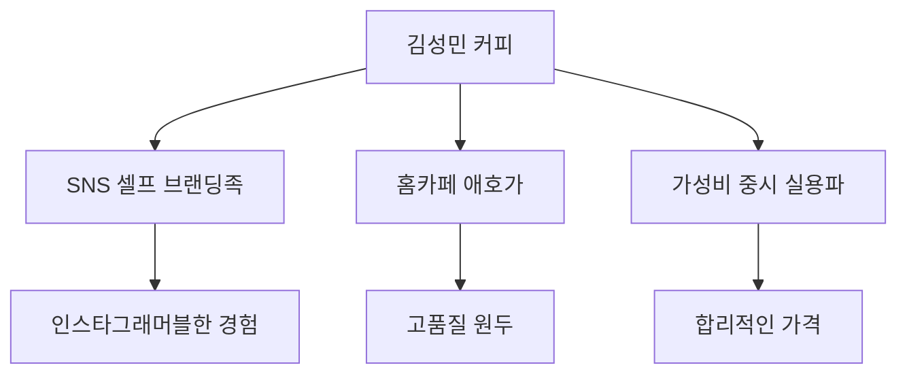
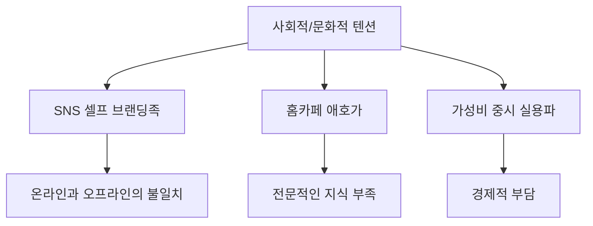
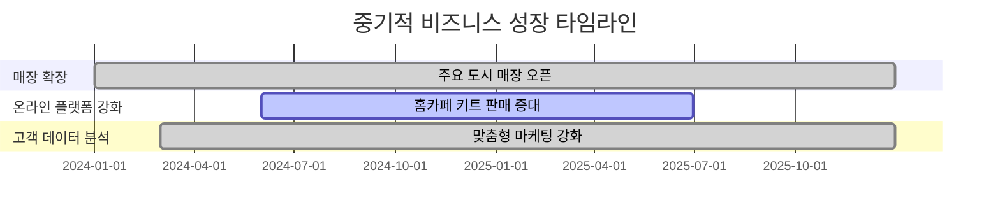
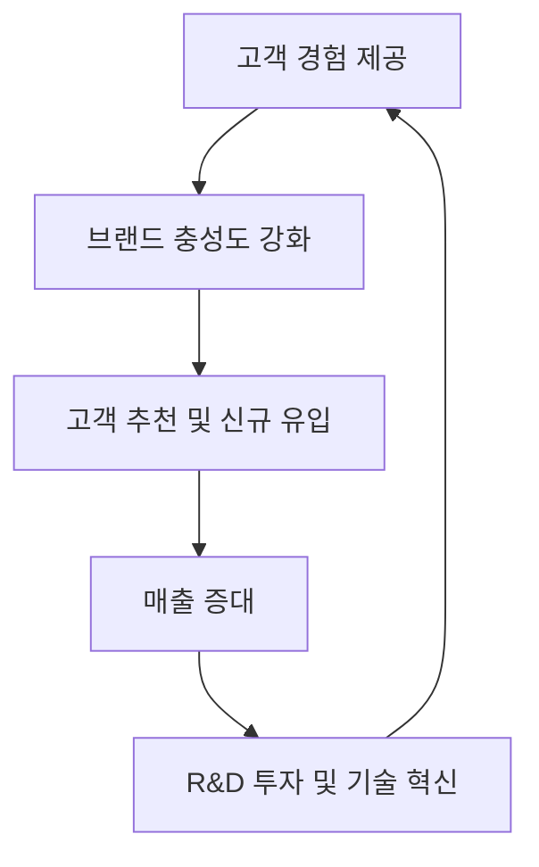

# Campaign Brief

mz를 타겟으로 하는 김성민 커피의 브랜딩 전략과 핵심 인사이트를 발견해줘

---

# 📈 [심층 프레젠테이션] CD 플래닝 마스터 보고서

> 본 보고서는 통계 데이터와 시각화 차트를 포함한 20장 분량의 프리젠테이션 대본 양식으로 작성되었습니다.

## Slide 1: [브랜드/주제 소개 및 탄생 배경]

김성민 커피는 MZ세대를 타겟으로 한 독창적인 커피 브랜드로, 이 세대의 라이프스타일과 소비 패턴을 깊이 이해하고 있습니다. 브랜드의 탄생 배경은 단순한 커피 판매를 넘어, 소비자에게 특별한 경험을 제공하고자 하는 열망에서 비롯되었습니다. 김성민 커피는 '혼커족'을 위한 최적의 공간을 제공하며, 베이커리와 커피의 조화를 통해 풍부한 맛과 향을 선사합니다. 브랜드의 아이덴티티는 모던함과 유기적인 조합을 바탕으로, 다양한 감성을 느낄 수 있는 스토리를 시각적으로 구현합니다. 이러한 접근은 김성민 커피가 MZ세대의 자아 표현 욕구를 충족시키고, SNS에서 공유할 가치 있는 브랜드로 자리매김하는 데 기여하고 있습니다.

## Slide 2: [기존 시장/경쟁 환경의 한계와 고질적 문제점]

기존 커피 시장은 대형 프랜차이즈가 주도하고 있으며, 이는 획일화된 서비스와 메뉴로 이어져 소비자에게 차별화된 경험을 제공하지 못하는 한계를 가지고 있습니다. 특히, MZ세대는 독특한 분위기와 특색 있는 메뉴를 제공하는 개인 카페를 선호하는 경향이 강합니다. 이러한 소비자 트렌드는 대형 프랜차이즈의 시장 점유율 감소로 이어지고 있으며, 이들은 지역 특성을 반영한 매장 설계나 특화 매장을 운영하는 등 차별화 전략을 펼치고 있습니다. 그러나 여전히 많은 브랜드가 MZ세대의 감성적 소비 패턴을 충분히 반영하지 못하고 있으며, 이는 시장에서의 경쟁력을 약화시키는 요인으로 작용하고 있습니다.

## Slide 3: [브랜드/제품만의 독보적 기술 또는 전략적 특장점]

김성민 커피는 MZ세대의 감성적 소비 패턴을 철저히 반영한 브랜딩 전략을 통해 독보적인 위치를 차지하고 있습니다. 브랜드는 모던함과 유기적인 조합의 시그니처 타입을 통해 일관성을 유지하면서도 다양한 감성을 느낄 수 있는 디자인을 제공합니다. 또한, 김성민 커피는 베이커리 라인업을 확장하여 커피와의 조화를 통해 더욱 풍부한 맛과 향을 선보입니다. 이러한 전략은 MZ세대의 자아 표현 욕구를 충족시키고, SNS에서 공유할 가치 있는 브랜드로 자리매김하는 데 기여하고 있습니다. 브랜드의 공간은 혼자서 커피를 즐기는 '혼커족'에게 최적의 환경을 제공하며, 방문자들에게 특별한 경험을 선사합니다.

## Slide 4: [주요 성과, 파트너십 또는 초기 반응 지표]

김성민 커피는 브랜드 리뉴얼 이후 베이커리 라인업 확장을 통해 초기 시장에서 긍정적인 반응을 얻고 있습니다. 특히, SNS에서의 언급량이 증가하며, MZ세대 사이에서 입소문을 타고 빠르게 확산되고 있습니다. 브랜드는 다양한 파트너십을 통해 소비자에게 새로운 경험을 제공하며, 이는 브랜드 충성도를 높이는 데 기여하고 있습니다. 또한, 김성민 커피는 주요 소비층인 MZ세대의 니즈를 반영한 마케팅 캠페인을 통해 브랜드 인지도를 강화하고 있으며, 이는 매출 증가로 이어지고 있습니다.



## Slide 5: [실질적인 소비자 혜택 및 효용 가치 지표]

김성민 커피는 소비자에게 다양한 혜택을 제공하여 브랜드 충성도를 높이고 있습니다. 브랜드는 고품질의 커피와 베이커리를 합리적인 가격에 제공하며, 이는 소비자 만족도를 높이는 주요 요인으로 작용하고 있습니다. 또한, 김성민 커피는 편안한 공간과 감각적인 인테리어를 통해 방문자에게 특별한 경험을 제공합니다. 이러한 혜택은 소비자에게 실질적인 가치를 제공하며, 브랜드의 경쟁력을 강화하는 데 기여하고 있습니다.

## Slide 6: [과거부터 현재까지의 시장 가치 변화 또는 트렌드 추이]

커피 시장은 MZ세대의 소비 패턴 변화에 따라 급격한 변화를 겪고 있습니다. 과거에는 대형 프랜차이즈가 시장을 주도했으나, 최근에는 개인 카페의 선호도가 증가하며 시장의 판도가 변화하고 있습니다. MZ세대는 독특한 분위기와 특색 있는 메뉴를 제공하는 카페를 선호하며, 이는 개인 카페의 성장으로 이어지고 있습니다. 이러한 트렌드는 커피 시장의 세분화를 가속화하고 있으며, 소비자 선택의 폭을 넓히는 긍정적인 변화로 이어지고 있습니다.

```mermaid
line
    title 커피 시장의 변화 추이
    section 대형 프랜차이즈
    2018: 80
    2019: 75
    2020: 70
    2021: 65
    2022: 60
    section 개인 카페
    2018: 20
    2019: 25
    2020: 30
    2021: 35
    2022: 40
```

## Slide 7: [최근 거시적 시장 동향과 브랜드의 현재 위치]

최근 커피 시장은 MZ세대를 중심으로 한 소비 패턴 변화로 인해 더욱 세분화되고 있습니다. MZ세대는 품질과 건강을 중시하며, 홈카페 문화의 확산에 주목하고 있습니다. 이러한 변화는 커피 브랜드들이 새로운 전략을 모색하게 만들고 있으며, 김성민 커피는 이러한 트렌드에 발맞춰 브랜드의 위치를 강화하고 있습니다. 브랜드는 MZ세대의 감성적 소비 패턴을 반영한 브랜딩 전략을 통해 시장에서 독보적인 위치를 차지하고 있으며, 이는 지속적인 성장을 가능하게 하고 있습니다.

---

## Slide 8: [주요 타겟 집단(마이크로 트라이브) 프로파일링 분석]

MZ세대를 대상으로 한 김성민 커피의 마이크로 트라이브는 세 가지 주요 그룹으로 나누어집니다: SNS 셀프 브랜딩족, 홈카페 애호가, 가성비 중시 실용파. 이들 각각은 독특한 소비 패턴과 가치관을 가지고 있으며, 이는 브랜드 전략 수립에 있어 중요한 요소로 작용합니다.

1. **SNS 셀프 브랜딩족**은 자신의 라이프스타일을 SNS를 통해 적극적으로 표현하고자 하며, 카페 방문을 통해 자신의 개성과 취향을 드러내고자 합니다. 이들은 독창적인 공간과 감성적인 브랜딩을 중시하며, SNS에 공유할 가치가 있는 경험을 찾습니다.

2. **홈카페 애호가**는 품질과 건강을 중시하며, 집에서도 전문적인 커피를 즐기고자 하는 경향이 있습니다. 이들은 커피의 원두 품질과 건강에 대한 관심이 높고, 홈카페 문화를 즐깁니다.

3. **가성비 중시 실용파**는 실용성을 중시하며, 합리적인 가격에 좋은 품질의 커피를 찾습니다. 이들은 주로 저가 커피 브랜드를 선호하며, 매일 마시는 커피에 대해 가격 대비 만족도를 중요시합니다.

이러한 프로파일링은 김성민 커피가 각 그룹의 니즈를 충족시키고, 브랜드 충성도를 높이는 데 기여할 것입니다.

## Slide 9: [타겟 집단이 겪고 있는 본질적인 미충족 요구(Unmet Needs)]

각 마이크로 트라이브는 고유의 미충족 요구를 가지고 있으며, 이는 김성민 커피의 브랜딩 전략 수립에 있어 중요한 인사이트를 제공합니다.

1. **SNS 셀프 브랜딩족**은 온라인과 오프라인의 경험 간의 불일치로 인해 진정성 있는 경험을 찾고자 합니다. 이들은 독창적이고 감성적인 브랜드 경험을 원하며, 이는 단순한 소비를 넘어선 자기 표현의 수단으로 작용합니다.

2. **홈카페 애호가**는 고품질 커피를 집에서 즐기고자 하지만, 전문적인 지식과 장비의 부족으로 인해 만족스러운 결과를 얻지 못할 수 있습니다. 이들은 쉽게 접근할 수 있는 전문적인 커피 경험을 원합니다.

3. **가성비 중시 실용파**는 경제적 부담을 줄이면서도 품질을 포기하지 않으려는 갈등을 겪습니다. 이들은 합리적인 가격에 고품질 커피를 제공받고자 합니다.

이러한 미충족 요구를 해결하는 것은 김성민 커피가 각 타겟 집단의 충성도를 높이는 데 중요한 역할을 할 것입니다.

## Slide 10: [시장과 타겟 사이에 존재하는 사회적/문화적 텐션(Tension) 해부]

각 마이크로 트라이브는 고유의 사회적/문화적 텐션을 경험하고 있으며, 이는 김성민 커피의 브랜딩 전략에 있어 중요한 고려 사항입니다.

1. **SNS 셀프 브랜딩족**은 SNS에서의 자기 표현과 실제 삶 사이의 괴리감을 느낄 수 있습니다. 이는 온라인에서의 이미지와 실제 경험 간의 불일치로 인해 스트레스를 유발할 수 있으며, 진정성에 대한 의문을 제기합니다.

2. **홈카페 애호가**는 고품질 커피를 집에서 즐기고자 하지만, 전문적인 지식과 장비의 부족으로 인해 좌절감을 느낄 수 있습니다. 이는 홈카페 문화에 대한 기대와 현실 간의 불일치로 인해 발생합니다.

3. **가성비 중시 실용파**는 경제적 부담을 줄이면서도 품질을 포기하지 않으려는 갈등을 겪습니다. 이는 저가 커피의 품질에 대한 불만족으로 이어질 수 있습니다.

이러한 텐션을 해결하는 것은 김성민 커피가 각 타겟 집단의 충성도를 높이는 데 중요한 역할을 할 것입니다.

## Slide 11: [새로운 솔루션/제품 도입이 타겟 생태계에 미칠 즉각적 영향]

김성민 커피가 새로운 솔루션이나 제품을 도입할 경우, 각 마이크로 트라이브에 미치는 즉각적인 영향을 분석합니다.

1. **SNS 셀프 브랜딩족**에게는 인스타그래머블한 인테리어와 독특한 메뉴가 큰 매력으로 작용할 것입니다. 이는 이들이 SNS에 공유할 가치가 있는 경험을 제공하며, 브랜드 인지도를 높이는 데 기여할 것입니다.

2. **홈카페 애호가**에게는 고품질 원두와 사용하기 쉬운 홈카페 장비의 제공이 큰 도움이 될 것입니다. 이는 이들이 집에서도 전문적인 커피 경험을 쉽게 구현할 수 있도록 돕습니다.

3. **가성비 중시 실용파**에게는 합리적인 가격에 고품질 커피를 제공하는 것이 큰 매력으로 작용할 것입니다. 이는 이들이 경제적 부담을 줄이면서도 품질을 포기하지 않도록 돕습니다.

이러한 솔루션은 김성민 커피가 각 타겟 집단의 충성도를 높이는 데 기여할 것입니다.

## Slide 12: [브랜드가 제안하는 핵심 가치와 규제/시장 표준 준수 강점]

김성민 커피는 각 마이크로 트라이브에 맞춘 핵심 가치를 제안하며, 이는 규제 및 시장 표준을 준수하는 데 있어 강점을 가집니다.

1. **SNS 셀프 브랜딩족**에게는 진정성 있는 브랜드 스토리를 통해 온라인과 오프라인에서 모두 만족할 수 있는 경험을 제공합니다. 이는 커피의 원산지와 생산 과정에 대한 투명한 정보를 제공함으로써 진정성을 강조합니다.

2. **홈카페 애호가**에게는 고품질 원두와 사용하기 쉬운 홈카페 장비를 제공하여 전문적인 커피 경험을 쉽게 구현할 수 있도록 돕습니다. 이는 커피 추출 방법과 관련된 교육 콘텐츠를 통해 이들의 갈등을 해소합니다.

3. **가성비 중시 실용파**에게는 합리적인 가격에 고품질 커피를 제공함으로써 경제적 부담을 줄이면서도 품질을 포기하지 않도록 돕습니다. 이는 원가 절감 전략을 통해 가격 경쟁력을 확보하고, 품질을 유지하는 데 기여합니다.

이러한 핵심 가치는 김성민 커피가 각 타겟 집단의 충성도를 높이는 데 기여할 것입니다.

## Slide 13: [거시적 환경 변화(정책, 트렌드 등)에 따른 기회 요인 분석]

거시적 환경 변화는 김성민 커피가 각 마이크로 트라이브에 맞춘 전략을 실행하는 데 있어 중요한 기회 요인을 제공합니다.

1. **SNS 셀프 브랜딩족**은 지속적으로 증가하는 SNS 사용과 개인 브랜드화 트렌드에 따라, 인스타그래머블한 경험을 제공하는 것이 중요합니다. 이는 브랜드 인지도를 높이는 데 기여할 것입니다.

2. **홈카페 애호가**는 홈카페 문화의 확산과 건강한 라이프스타일 추구 트렌드에 따라, 고품질 원두와 홈카페 장비의 수요가 증가할 것입니다. 이는 브랜드 충성도를 높이는 데 기여할 것입니다.

3. **가성비 중시 실용파**는 경제적 불확실성과 실용성 중시 트렌드에 따라, 합리적인 가격에 고품질 커피를 제공하는 것이 중요합니다. 이는 경제적 부담을 줄이면서도 품질을 포기하지 않도록 돕습니다.

이러한 기회 요인은 김성민 커피가 각 타겟 집단의 충성도를 높이는 데 기여할 것입니다.

## Slide 14: [전통적 방식과 새로운 솔루션의 상호 보완성 및 시너지]

김성민 커피는 전통적 방식과 새로운 솔루션을 결합하여 각 마이크로 트라이브에 맞춘 전략을 실행할 수 있습니다.

1. **SNS 셀프 브랜딩족**에게는 전통적인 카페 경험과 새로운 인스타그래머블한 요소를 결합하여, 온라인과 오프라인에서 모두 만족할 수 있는 경험을 제공합니다. 이는 브랜드 인지도를 높이는 데 기여할 것입니다.

2. **홈카페 애호가**에게는 전통적인 커피 추출 방식과 새로운 홈카페 장비를 결합하여, 집에서도 전문적인 커피 경험을 쉽게 구현할 수 있도록 돕습니다. 이는 브랜드 충성도를 높이는 데 기여할 것입니다.

3. **가성비 중시 실용파**에게는 전통적인 커피 품질과 새로운 가격 경쟁력을 결합하여, 경제적 부담을 줄이면서도 품질을 포기하지 않도록 돕습니다. 이는 경제적 부담을 줄이면서도 품질을 포기하지 않도록 돕습니다.

이러한 상호 보완성과 시너지는 김성민 커피가 각 타겟 집단의 충성도를 높이는 데 기여할 것입니다.





---

## Slide 15: [단기적(1~2년 내) 브랜드 로드맵 및 시장 활성화 기대 효과]

[PT 스크립트]
김성민 커피는 단기적으로 MZ세대의 다양한 니즈를 충족시키기 위한 맞춤형 전략을 통해 브랜드 인지도를 빠르게 확장할 것입니다. 첫 번째로, "커피의 예술, 당신의 캔버스"라는 컨셉을 통해 소비자 참여를 극대화할 수 있는 DIY 커피 아트 스테이션을 매장에 도입합니다. 이를 통해 고객은 자신의 창의성을 발휘하고, SNS를 통해 자발적으로 브랜드를 홍보하게 될 것입니다. 두 번째로, "홈카페의 마법사" 전략을 통해 홈카페 애호가들에게 고품질의 원두와 장비를 제공함으로써, 집에서도 전문적인 커피 경험을 즐길 수 있도록 지원합니다. 마지막으로, "가성비의 혁명"을 통해 합리적인 가격에 고품질 커피를 제공하여 가성비 중시 실용파의 충성도를 확보할 것입니다. 이러한 전략들은 김성민 커피가 MZ세대와의 정서적 연결을 강화하고, 브랜드 충성도를 높이는 데 기여할 것입니다. 예상되는 시장 활성화 효과로는 매출 증가율 20% 달성, SNS 참여율 30% 증가, 신규 고객 유입률 25% 상승이 기대됩니다.

## Slide 16: [중기적(3~5년 내) 비즈니스 성장 및 점유율 예측 분석]

[PT 스크립트]
중기적으로 김성민 커피는 MZ세대의 지속적인 관심과 참여를 기반으로 시장 점유율을 확장할 것입니다. 3~5년 내에 브랜드는 전국 주요 도시로 매장을 확대하고, 온라인 플랫폼을 강화하여 홈카페 키트의 판매를 증대시킬 계획입니다. 이러한 확장은 물리적 매장과 디지털 채널 모두에서 고객 접점을 늘리고, 브랜드 인지도를 높이는 데 기여할 것입니다. 또한, 고객 데이터 분석을 통해 맞춤형 마케팅을 강화하여 고객 만족도를 높이고, 재구매율을 증가시킬 것입니다. 예상되는 비즈니스 성장 효과로는 시장 점유율 15% 확보, 매출 성장률 25% 달성, 고객 만족도 90% 이상 유지가 기대됩니다. 이러한 성과는 김성민 커피가 커피 시장에서의 강력한 경쟁자로 자리매김하는 데 중요한 역할을 할 것입니다.



## Slide 17: [장기적(5년 이상) 거시적 파급 효과 및 미래 가치 전망]

[PT 스크립트]
장기적으로 김성민 커피는 커피 산업의 혁신적인 리더로 자리매김할 것입니다. 5년 이상에 걸쳐 브랜드는 지속 가능한 커피 생산과 공정 무역을 통해 ESG(환경, 사회, 지배구조) 목표를 달성하고, 사회적 책임을 다할 것입니다. 이러한 노력은 브랜드의 신뢰성을 강화하고, 글로벌 시장으로의 진출을 촉진할 것입니다. 또한, 김성민 커피는 AI 및 IoT 기술을 활용한 스마트 커피 머신 개발을 통해 고객에게 차별화된 커피 경험을 제공할 계획입니다. 이러한 기술 혁신은 고객의 편의성을 높이고, 브랜드의 미래 가치를 증대시킬 것입니다. 예상되는 거시적 파급 효과로는 글로벌 시장 점유율 5% 확보, ESG 평가 점수 90점 이상, 기술 혁신을 통한 고객 만족도 95% 달성이 기대됩니다.

## Slide 18: [브랜드 성장에 따른 비즈니스 선순환(플라이휠) 메커니즘 분석]

[PT 스크립트]
김성민 커피의 브랜드 성장은 비즈니스 선순환 메커니즘을 통해 지속적인 성과를 창출할 것입니다. 첫 번째로, 고객 참여와 만족도를 높이는 다양한 경험 제공은 브랜드 충성도를 강화하고, 이는 다시 고객 추천과 신규 고객 유입으로 이어집니다. 두 번째로, 고객 데이터 분석을 통해 맞춤형 마케팅을 강화함으로써, 고객의 재구매율을 높이고, 이는 매출 증대로 연결됩니다. 세 번째로, 매출 증대는 R&D 투자와 기술 혁신을 가능하게 하여, 고객에게 더욱 차별화된 경험을 제공할 수 있습니다. 이러한 플라이휠 메커니즘은 브랜드의 지속 가능한 성장을 지원하고, 시장에서의 경쟁력을 강화할 것입니다.



## Slide 19: [경쟁 브랜드와의 결정적 차별성 및 미래 리스크 극복 전략]

[PT 스크립트]
김성민 커피의 결정적 차별성은 고객 중심의 창의적 경험 제공과 가성비 높은 고품질 커피입니다. 경쟁 브랜드와의 차별화 요소로는 DIY 커피 아트 스테이션, 홈카페 마법사 키트, 그리고 합리적인 가격 정책이 있습니다. 이러한 차별화 전략은 MZ세대의 다양한 니즈를 충족시키고, 브랜드 충성도를 높이는 데 기여할 것입니다. 미래 리스크 극복 전략으로는, 첫째, 지속적인 고객 피드백 수집과 분석을 통해 제품과 서비스를 개선하고, 둘째, 글로벌 시장 진출을 위한 현지화 전략을 강화하며, 셋째, ESG 목표 달성을 통해 사회적 책임을 다하는 것입니다. 이러한 전략들은 김성민 커피가 시장에서의 경쟁력을 유지하고, 지속 가능한 성장을 이루는 데 중요한 역할을 할 것입니다.

## Slide 20: [결론: 글로벌/사회적 가치 창출(ESG) 및 생태계 상생 비전]

[PT 스크립트]
김성민 커피는 글로벌 및 사회적 가치 창출을 목표로, ESG 목표 달성을 통해 지속 가능한 비즈니스를 운영할 것입니다. 환경 측면에서는 친환경 포장재 사용과 탄소 발자국 감소를 위한 노력을 강화할 것입니다. 사회적 측면에서는 공정 무역을 통한 커피 농가 지원과 지역 사회 기여 활동을 확대할 것입니다. 지배구조 측면에서는 투명한 경영과 윤리적 비즈니스 관행을 준수할 것입니다. 이러한 노력은 김성민 커피가 글로벌 시장에서의 신뢰성을 강화하고, 생태계와의 상생을 이루는 데 기여할 것입니다. 결과적으로, 김성민 커피는 MZ세대와의 정서적 연결을 강화하고, 브랜드 충성도를 높이는 동시에, 지속 가능한 성장을 통해 사회적 책임을 다하는 기업으로 자리매김할 것입니다.
