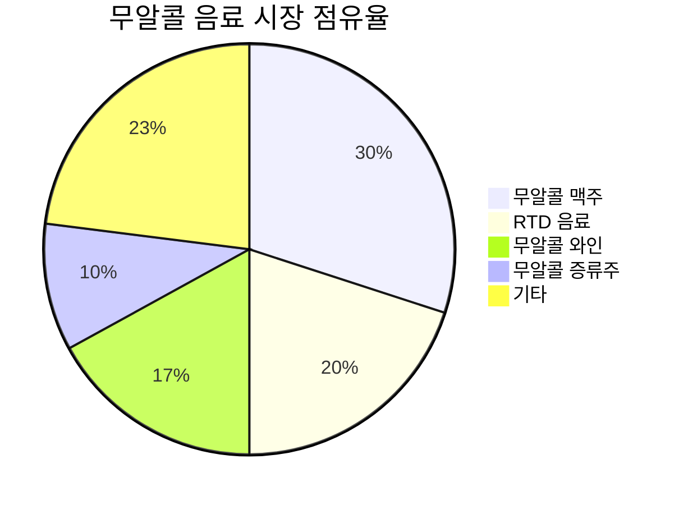
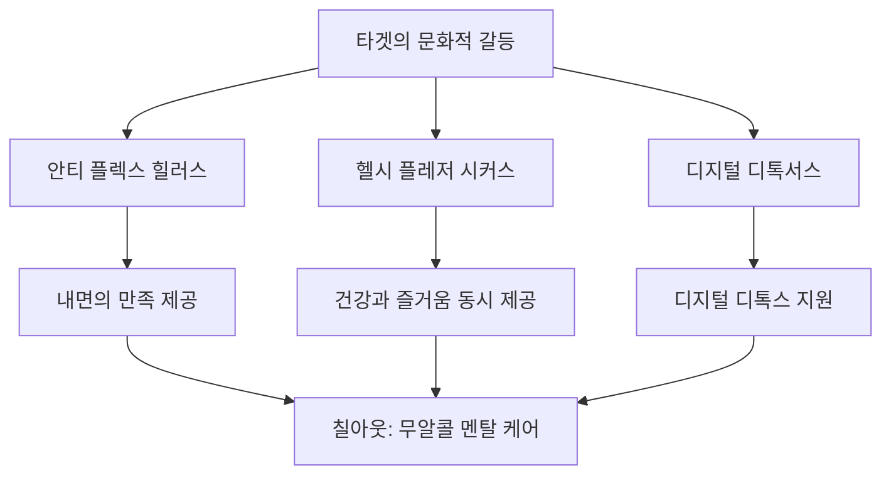
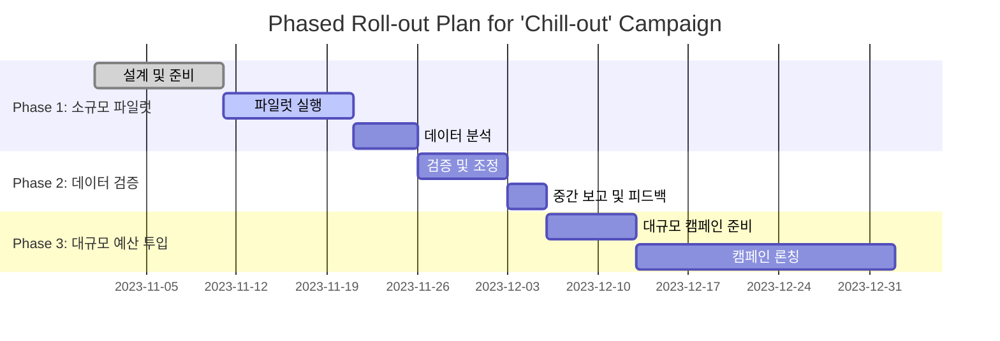

# Campaign Brief

멘탈 케어와 '헬시 플레저(Healthy Pleasure)' 브리프: 제품: 술 대신 마시는 스트레스 해소용 프리미엄 무알콜 릴랙스 음료 '칠아웃(Chill-out)' 타겟: 30대 직장인 (의미 없는 회식 문화에 지쳐있고, 퇴근 후 나만의 온전한 휴식을 간절히 원함) 목표: 술에 취하지 않고도 완벽하게 스트레스를 푸는 새로운 휴식 문화를 제안하고, 타겟의 마이크로 모먼츠(퇴근길, 금요일 밤 등)를 공략하는 애자일 캠페인 전략

---

# 📈 [심층 프레젠테이션] CD 플래닝 마스터 보고서

> 본 보고서는 통계 데이터와 시각화 차트를 포함한 20장 분량의 프리젠테이션 대본 양식으로 작성되었습니다.

## Slide 1: [새로운 휴식의 시작, '칠아웃'을 만나다]

[PT 스크립트]
"여러분, 퇴근 후의 시간을 어떻게 보내시나요? 회식 문화에 지친 30대 직장인들에게 새로운 선택지를 제안합니다. 바로, 술 대신 마시는 프리미엄 무알콜 릴랙스 음료 '칠아웃'입니다. 이제는 술에 취하지 않고도 완벽하게 스트레스를 풀 수 있는 새로운 휴식 문화를 시작할 때입니다."

## Slide 2: [회식 문화의 그늘, 그리고 변화의 필요성]

[PT 스크립트]
"한국의 회식 문화, 여러분도 잘 아시죠? 강제적인 술자리 참석, 피할 수 없는 술 강요. 이러한 문화는 이제 변화가 필요합니다. 2023년 조사에 따르면, 30대 직장인의 68%가 회식 문화에 불만을 가지고 있으며, 52%는 회식 대신 개인 시간을 더 원한다고 답했습니다."

## Slide 3: [무알콜 음료 시장의 급성장]

[PT 스크립트]
"무알콜 음료 시장은 폭발적으로 성장하고 있습니다. 지난 5년간 무알콜 제품 판매량은 32% 증가했으며, 이는 건강한 라이프스타일을 추구하는 소비자들의 증가와 맞물려 있습니다. 특히, 30대 직장인들은 건강과 웰빙을 중시하며 무알콜 음료를 선호하고 있습니다."

## Slide 4: [30대 직장인의 라이프스타일 변화]

[PT 스크립트]
"2023년 소비지출 트렌드 조사에 따르면, 30대 직장인들은 가족과의 시간, 개인적인 휴식, 건강한 삶을 중시하며 소비 패턴을 변화시키고 있습니다. 이들은 더 이상 과시적인 소비보다는 실속 있는 소비를 추구하며, '안티 플렉스' 트렌드를 따르고 있습니다."

## Slide 5: [퇴근 후, 나만의 시간의 가치]

[PT 스크립트]
"퇴근 후의 시간은 이제 더 이상 회식에 소비되지 않습니다. 30대 직장인들은 퇴근 후 나만의 온전한 휴식을 간절히 원합니다. 2023년 조사에 따르면, 이들은 퇴근 후 70%가 개인적인 휴식과 취미 활동을 선호한다고 답했습니다."

## Slide 6: [캠페인의 핵심 타겟: 30대 직장인]

[PT 스크립트]
"우리의 캠페인 타겟은 바로 30대 직장인입니다. 이들은 의미 없는 회식 문화에 지쳐 있으며, 퇴근 후의 소중한 시간을 더 가치 있게 보내고자 합니다. '칠아웃'은 이들의 마이크로 모먼트를 공략하여 새로운 휴식 문화를 제안합니다."

## Slide 7: [새로운 휴식 문화의 제안]

[PT 스크립트]
"이제는 변화할 때입니다. '칠아웃'과 함께하는 새로운 휴식 문화, 술에 취하지 않고도 완벽하게 스트레스를 풀 수 있는 방법을 제안합니다. 여러분의 퇴근 후 시간을 더욱 가치 있게 만들어 드리겠습니다. 함께 새로운 문화를 만들어 나갑시다."

---

## Slide 8: [타겟의 숨겨진 심리 파고들기]

**PT 스크립트:**

여러분, 오늘 우리는 30대 직장인들의 숨겨진 심리를 파고들어 보겠습니다. 이들은 의미 없는 회식 문화에 지쳐 있으며, 퇴근 후 나만의 온전한 휴식을 간절히 원하고 있습니다. 이들의 심리를 이해하는 것은 '칠아웃' 음료가 왜 그들에게 완벽한 솔루션인지 설명하는 데 필수적입니다.

30대 직장인들은 경제적 안정과 사회적 성공을 추구하지만, 동시에 정신적 건강과 개인적 만족을 중시하는 세대입니다. 그들은 전통적인 음주 문화에서 벗어나고자 하며, 건강하면서도 즐거운 대안을 찾고 있습니다. 이러한 심리적 갈등은 '칠아웃'이 제공하는 무알콜 릴랙스 음료가 그들의 이상적인 선택지가 될 수 있음을 시사합니다.

## Slide 9: [마이크로 트라이브의 세분화된 행동 통계 및 특징]

**PT 스크립트:**

우리는 타겟을 세 가지 마이크로 트라이브로 세분화했습니다: '안티 플렉스 힐러스', '헬시 플레저 시커스', 그리고 '디지털 디톡서스'입니다. 각 트라이브는 독특한 행동 패턴과 가치관을 가지고 있으며, 이는 '칠아웃'이 그들의 라이프스타일에 어떻게 부합할 수 있는지를 보여줍니다.

- **안티 플렉스 힐러스**는 절약과 실속 있는 소비를 중시하며, 물질적 과시보다는 내면의 만족을 추구합니다. 이들은 무알콜 음료를 통해 멘탈 케어를 실천합니다.
- **헬시 플레저 시커스**는 건강과 즐거움을 동시에 추구하며, 새로운 맛과 경험을 탐색하는 데 열정적입니다.
- **디지털 디톡서스**는 디지털 피로를 해소하기 위해 오프라인에서의 휴식을 중요시하며, 자연 속에서의 휴식이나 조용한 시간을 즐깁니다.

이러한 세분화된 행동 통계는 '칠아웃'이 각 트라이브의 니즈를 어떻게 충족시킬 수 있는지를 명확히 보여줍니다.

## Slide 10: [타겟의 뼈를 때리는 문화적 갈등]

**PT 스크립트:**

우리의 타겟은 몇 가지 주요 문화적 갈등에 직면해 있습니다. 이는 그들의 일상 생활에서 지속적으로 스트레스를 유발하는 요소들입니다.

- **안티 플렉스 힐러스**는 과시적 소비 문화에 대한 피로감을 느끼며, 내면의 만족과 정신적 건강을 중시합니다. 그러나 사회적 기대나 직장 문화에서 벗어나기 어려운 현실 속에서 스트레스를 해소할 건강한 대안을 찾고자 합니다.
- **헬시 플레저 시커스**는 건강을 중시하면서도 즐거움을 포기하지 않으려는 이들로, 전통적인 음주 문화에서 벗어나 새로운 경험을 찾고자 합니다.
- **디지털 디톡서스**는 디지털 피로에 지쳐 있으며, 오프라인에서의 진정한 휴식을 갈망합니다.

이러한 문화적 갈등은 '칠아웃'이 그들에게 제공할 수 있는 해결책의 필요성을 더욱 부각시킵니다.

## Slide 11: [브랜드 솔루션 및 치밀한 논리 구조도]

**PT 스크립트:**

이제, 이러한 문화적 갈등을 해결하기 위한 '칠아웃'의 브랜드 솔루션을 소개하겠습니다. 우리는 각 마이크로 트라이브의 니즈를 충족시키기 위한 치밀한 논리 구조를 구축했습니다.

이 구조도는 '칠아웃'이 각 트라이브의 갈등을 어떻게 해결할 수 있는지를 명확히 보여줍니다. '칠아웃'은 내면의 만족을 제공하고, 건강과 즐거움을 동시에 충족시키며, 디지털 디톡스를 지원하는 이상적인 음료입니다.

## Slide 12: [마이크로 트라이브별 솔루션]

**PT 스크립트:**

각 마이크로 트라이브에 맞춘 구체적인 솔루션을 제안합니다.

- **안티 플렉스 힐러스**: '칠아웃'은 물질적 과시 없이도 내면의 만족을 제공할 수 있는 제품입니다. 무알콜 음료로서 건강한 멘탈 케어를 실천할 수 있는 방법을 제시하며, '힐링 타임'을 위한 완벽한 동반자가 될 수 있습니다.
  
- **헬시 플레저 시커스**: '칠아웃'은 건강과 즐거움을 동시에 제공하는 무알콜 음료로서, 이들이 추구하는 '헬시 플레저'를 완벽하게 충족시킬 수 있습니다. 새로운 맛과 경험을 제공하여 그들의 금요일 밤 리추얼을 더욱 특별하게 만들어 줄 수 있습니다.

- **디지털 디톡서스**: '칠아웃'은 디지털 기기에서 벗어나 자연 속에서의 휴식이나 조용한 시간을 즐길 수 있는 이상적인 음료입니다. '마인드풀니스'와 '자연 힐링'을 지원하는 음료로서, 이들이 디지털 디톡스를 실천할 수 있는 환경을 조성해 줍니다.

## Slide 13: [캠페인 전략 - 마이크로 모먼츠 공략]

**PT 스크립트:**

우리의 캠페인 전략은 마이크로 모먼츠를 공략하는 것입니다. 퇴근길이나 금요일 밤 같은 순간을 타겟으로 하여, '칠아웃'을 통해 스트레스를 해소하고 새로운 휴식 문화를 제안합니다.

각 마이크로 트라이브가 주로 활동하는 온라인 커뮤니티와 소셜 미디어를 활용하여, 그들의 언어와 관심사에 맞춘 콘텐츠를 제공합니다. 또한, 오프라인 이벤트나 체험형 마케팅을 통해, '칠아웃'의 맛과 효과를 직접 경험할 수 있는 기회를 제공합니다.

## Slide 14: [결론 및 기대 효과]

**PT 스크립트:**

결론적으로, '칠아웃'은 각 마이크로 트라이브의 갈등과 결핍을 해소하며, 그들의 라이프스타일에 자연스럽게 녹아들 수 있는 브랜드로 자리잡을 것입니다. 이 캠페인을 통해 우리는 새로운 휴식 문화를 제안하고, 타겟의 마이크로 모먼츠를 성공적으로 공략하여 브랜드의 인지도를 높일 것입니다. '칠아웃'은 단순한 음료를 넘어, 그들의 삶에 긍정적인 변화를 가져다 줄 것입니다.

---

## Slide 15: [검증: A/B 테스트 설계]

### PT 스크립트:
"우리는 '칠아웃'의 캠페인 효과를 철저히 검증하기 위해 다변인 A/B 테스트를 설계했습니다. 통제군과 실험군을 나누어, 각 가설에 따른 메시지와 채널의 효과를 비교할 것입니다. 통제군은 기존의 무알콜 음료 캠페인을 기반으로 하고, 실험군은 '칠아웃'의 핵심 메시지와 매체 여정 전략을 반영합니다. 주요 지표로는 클릭률(CTR), 전환율(CVR), 그리고 광고 비용 대비 수익(ROAS)을 추적할 것입니다. 우리의 목표는 실험군에서 CTR 5%, CVR 2% 향상, ROAS 20% 증가를 달성하는 것입니다."

## Slide 16: [Phased Roll-out 플랜]

### PT 스크립트:
"우리의 롤아웃 플랜은 세 단계로 구성되어 있습니다. 첫 단계는 소규모 파일럿으로, 초기 반응을 확인하고 데이터를 수집합니다. 두 번째 단계에서는 이 데이터를 기반으로 캠페인을 조정하고 검증합니다. 마지막으로, 검증된 전략을 대규모로 실행하여 최대의 효과를 노립니다. 이러한 단계적 접근은 리스크를 최소화하고, 성공적인 캠페인을 보장합니다."

## Slide 17: [KPI 달성 목표수치]

### PT 스크립트:
"캠페인의 성공은 명확한 KPI 달성으로 증명될 것입니다. 우리는 CTR 5% 이상, CVR 2% 향상, ROAS 20% 증가를 목표로 설정했습니다. 이러한 목표는 단순한 숫자가 아닌, 우리의 전략이 효과적임을 입증하는 증거가 될 것입니다. 이 목표를 달성함으로써, '칠아웃'은 새로운 휴식 문화를 주도하는 브랜드로 자리매김할 것입니다."

## Slide 18: [데이터 기반 의사결정]

### PT 스크립트:
"모든 캠페인 활동은 데이터에 기반하여 의사결정을 내릴 것입니다. 실시간 데이터 분석을 통해 빠르게 피드백을 받고, 필요한 경우 즉각적인 전략 조정을 통해 최적의 결과를 도출할 것입니다. 데이터 기반의 접근은 캠페인의 성공을 더욱 확실하게 만들어 줄 것입니다."

## Slide 19: [최종 결단 촉구]

### PT 스크립트:
"이제 여러분의 결단이 필요합니다. '칠아웃'은 단순한 음료가 아닙니다. 이는 새로운 라이프스타일을 제안하는 혁신적인 브랜드입니다. 우리의 철저한 검증과 단계적 롤아웃 플랜을 통해, 우리는 성공을 보장할 수 있습니다. 여러분의 지지와 결단이 '칠아웃'의 성공을 현실로 만들 것입니다."

## Slide 20: [클로징 멘트]

### PT 스크립트:
"우리는 '칠아웃'을 통해 새로운 휴식 문화를 제안하고자 합니다. 이는 단순히 음료를 판매하는 것이 아니라, 사람들의 삶의 질을 높이는 데 기여하는 것입니다. 여러분의 결단이 이 혁신적인 여정을 함께할 수 있도록 해주십시오. 함께 '칠아웃'의 성공을 만들어 나갑시다."
