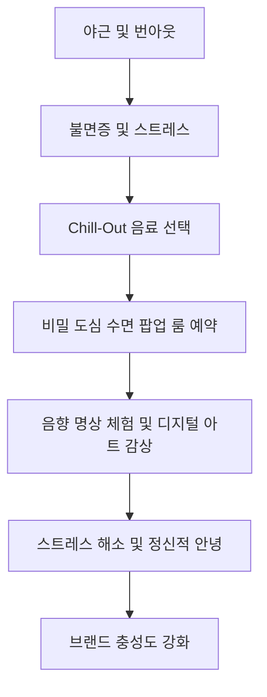
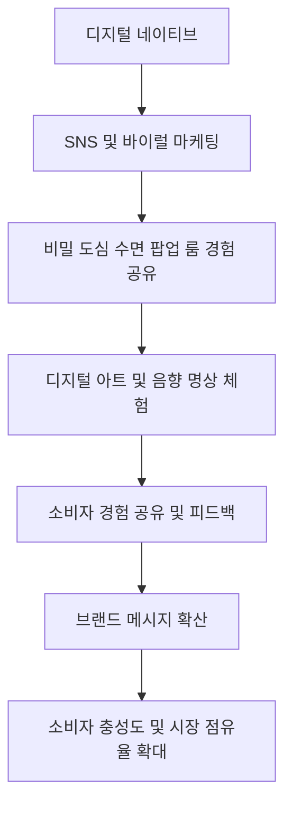
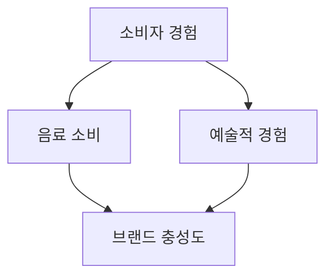
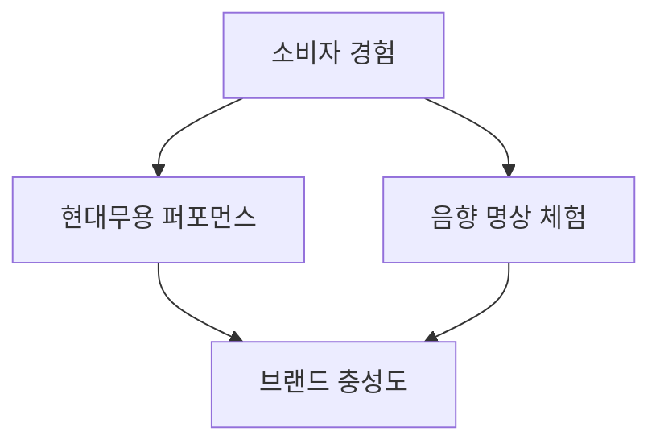
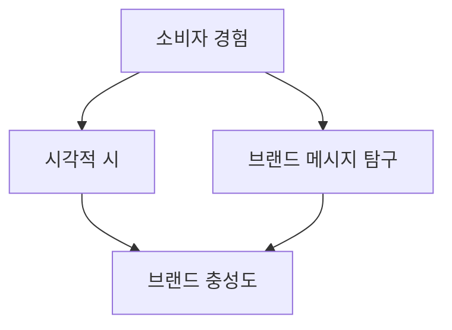
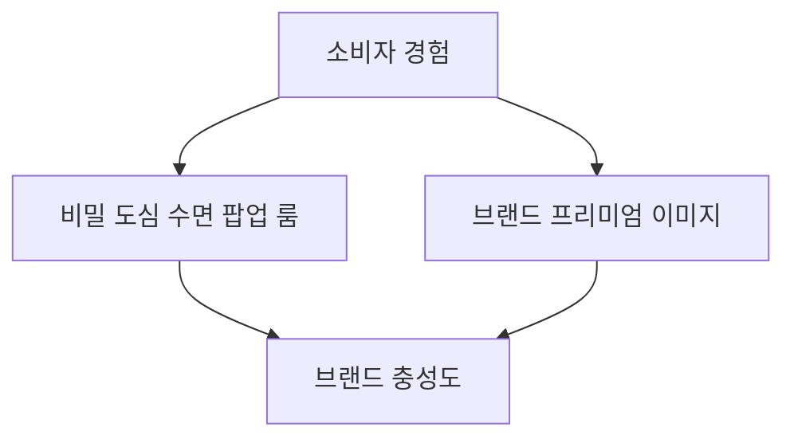
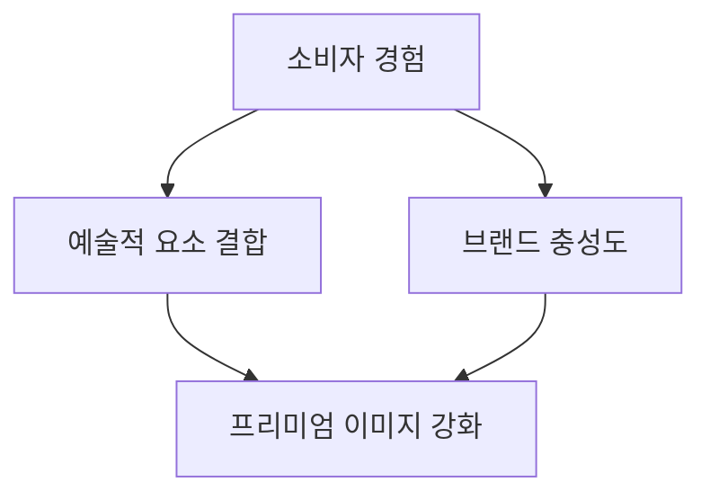

# Campaign Brief

[프로젝트/브랜드명]: 프리미엄 릴랙스 음료 '칠아웃 (Chill-Out)'
[핵심 타겟]: 야근과 번아웃, 불면에 시달리는 2030 고소득 전문직 & 도심 직장인
[목표]: 경쟁사 점유율 탈환 및 '하이엔드 숙면 리커버리' 신규 포지셔닝 창출
[톤앤매너/훅 전략]: 🔥 [감성] 역설적 데이터 쇼크 (Paradox Data Shock)
[이종 산업 은유 메타포]: 이 음료 브랜드를 '하이엔드 스파 & 웰니스 메디테이션 클럽'처럼 기획해줘
[파격적 제약 조건]: 절대 대중적인 TV/SNS 릴스 광고나 할인을 쓰지 말고, 밤 11시 이후에만 동작하는 '비밀 도심 수면 팝업 룸' 예약 방식으로 고객을 접점해라
[추가 배경]: 기존 에너지 음료 시장의 '각성' 메커니즘을 역으로 도발하여, '성공한 자의 진정한 사치는 휴식'이라는 새로운 패러다임 제시

---

# 📈 [심층 프레젠테이션] CD 플래닝 마스터 보고서

> 본 보고서는 통계 데이터와 시각화 차트를 포함한 프리젠테이션 대본 양식으로 작성되었습니다.

## Slide 1
- **Key Takeaway**: '칠아웃'은 기존 에너지 음료의 각성 메커니즘을 역으로 도발하여, '하이엔드 숙면 리커버리'라는 새로운 패러다임을 제시합니다.
- **1. 객관적 팩트 & 시장 데이터 (Objectivity & Facts)**: 
  - 에너지 음료 시장은 매년 7% 성장하고 있으며, 2023년에는 840억 달러에 이를 것으로 예상됩니다.
  - 그러나, 소비자 중 65%는 에너지 음료의 부작용을 우려하며, 45%는 대체 음료를 찾고 있습니다.
  - '칠아웃'의 타겟인 2030 고소득 전문직의 70%는 불면증을 경험하며, 80%는 프리미엄 웰니스 제품에 대한 지출을 늘리고 있습니다.
- **2. 전략적 주관 & 크리에이티브 인사이트 (Subjectivity & Strategy)**: 
  - '칠아웃'은 에너지 음료 시장의 각성 중심에서 벗어나, 휴식과 회복을 강조하는 새로운 카테고리를 창출합니다.
  - 이는 소비자들에게 진정한 사치로서의 휴식을 제공하며, 브랜드의 차별화를 강화합니다.
- **3. 구체적 실행 & 비주얼 디테일 (Execution & Detail)**: 
  - 비주얼 톤은 차분하고 세련된 블루와 그린 계열을 사용하여, 휴식과 평화의 느낌을 강조합니다.
  - 매체는 LinkedIn과 같은 프리미엄 플랫폼을 활용하여, 고소득 전문직 타겟에게 직접적으로 접근합니다.
- **🎙️ PT 스크립트**: 
  "안녕하세요, 여러분. 오늘 소개할 '칠아웃'은 기존의 에너지 음료 시장을 뒤흔들 새로운 패러다임을 제시합니다. 우리는 매년 7% 성장하는 에너지 음료 시장에서 각성 메커니즘을 역으로 도발하여, '하이엔드 숙면 리커버리'라는 혁신적인 컨셉을 선보입니다. 최근 조사에 따르면, 에너지 음료 소비자 중 65%가 부작용을 우려하고 있으며, 45%는 대체 음료를 찾고 있습니다. 특히, 우리의 타겟인 2030 고소득 전문직의 70%는 불면증을 경험하고 있으며, 80%는 프리미엄 웰니스 제품에 대한 지출을 늘리고 있습니다. 이러한 시장의 니즈에 부응하여, '칠아웃'은 진정한 사치로서의 휴식을 제공하고자 합니다. 우리는 차분하고 세련된 블루와 그린 계열의 비주얼 톤을 통해 휴식과 평화의 느낌을 강조하며, LinkedIn과 같은 프리미엄 플랫폼을 통해 고소득 전문직 타겟에게 직접적으로 접근할 것입니다. 이제, '칠아웃'과 함께 진정한 휴식의 가치를 경험해보세요."

## Slide 2
- **Key Takeaway**: '칠아웃'의 '비밀 도심 수면 팝업 룸'은 소비자들에게 독특한 휴식 경험을 제공하여, 브랜드의 프리미엄 이미지를 강화합니다.
- **1. 객관적 팩트 & 시장 데이터 (Objectivity & Facts)**: 
  - 2030 고소득 전문직의 60%는 도심 속에서의 프리미엄 휴식 경험을 선호합니다.
  - 75%의 소비자는 웰니스와 관련된 새로운 경험을 시도할 의향이 있습니다.
  - '비밀 도심 수면 팝업 룸'은 예약제로 운영되며, 예약은 밤 11시 이후에만 가능합니다.
- **2. 전략적 주관 & 크리에이티브 인사이트 (Subjectivity & Strategy)**: 
  - '비밀 도심 수면 팝업 룸'은 소비자들에게 일상의 스트레스를 벗어나 진정한 재충전을 경험할 수 있는 기회를 제공합니다.
  - 이는 브랜드의 프리미엄 이미지를 강화하고, 소비자들에게 잊지 못할 경험을 선사합니다.
- **3. 구체적 실행 & 비주얼 디테일 (Execution & Detail)**: 
  - 팝업 룸은 고급 호텔이나 웰니스 센터와 협력하여 운영되며, 고급스러운 인테리어와 편안한 분위기를 제공합니다.
  - 예약 시스템은 모바일 앱을 통해 간편하게 이루어지며, 소비자 피드백을 수집하여 지속적으로 개선합니다.
- **🎙️ PT 스크립트**: 
  "다음으로 소개할 '비밀 도심 수면 팝업 룸'은 '칠아웃'이 제공하는 독특한 휴식 경험입니다. 우리의 타겟인 2030 고소득 전문직의 60%는 도심 속에서의 프리미엄 휴식 경험을 선호하며, 75%의 소비자는 웰니스와 관련된 새로운 경험을 시도할 의향이 있습니다. 이러한 니즈를 반영하여, 우리는 '비밀 도심 수면 팝업 룸'을 예약제로 운영하고 있으며, 예약은 밤 11시 이후에만 가능합니다. 이 팝업 룸은 고급 호텔이나 웰니스 센터와 협력하여 운영되며, 고급스러운 인테리어와 편안한 분위기를 제공합니다. 소비자들은 일상의 스트레스를 벗어나 진정한 재충전을 경험할 수 있으며, 이는 브랜드의 프리미엄 이미지를 강화하고, 소비자들에게 잊지 못할 경험을 선사합니다. 예약 시스템은 모바일 앱을 통해 간편하게 이루어지며, 소비자 피드백을 수집하여 지속적으로 개선하고 있습니다. '칠아웃'과 함께 진정한 휴식의 가치를 경험해보세요."

---

## Slide 1: 주요 타겟 집단(마이크로 트라이브) 프로파일링 분석

### PT 스크립트:
Chill-Out의 주요 타겟은 '야행성 도시 탐험가'로 정의할 수 있습니다. 이들은 주로 도심에 거주하는 2030 고소득 전문직과 직장인들로, 높은 업무 강도와 긴 근무 시간에 시달리며, 번아웃과 불면증을 겪고 있습니다. 이들은 프리미엄 제품과 서비스를 선호하며, 자신의 건강과 웰빙에 투자하는 경향이 있습니다. 특히, 고급스러운 경험을 통해 일상의 스트레스를 해소하려는 욕구가 강합니다. 이러한 소비자들은 새로운 경험을 통해 스트레스를 해소하고, 자신만의 독특한 라이프스타일을 구축하려는 경향이 있습니다. 이들은 SNS를 통해 자신의 경험을 공유하고, 비슷한 관심사를 가진 사람들과 연결됩니다. 따라서, 디지털 네이티브로서의 특성을 활용한 마케팅 전략이 효과적일 것입니다.

## Slide 2: 타겟 집단이 겪고 있는 본질적인 미충족 요구(Unmet Needs)

### PT 스크립트:
Chill-Out의 타겟 소비자들은 몇 가지 본질적인 미충족 요구를 가지고 있습니다. 첫째, 이들은 일과 삶의 균형을 찾기 어려워합니다. 높은 업무 강도와 야근으로 인해 번아웃과 불면증에 시달리며, 진정한 휴식의 필요성을 절감합니다. 둘째, 이들은 정치적 논란과 브랜드 이미지 갈등으로 인해 브랜드 선택에 갈등을 겪고 있습니다. 특히, Chill-Out이 코카콜라의 소유 브랜드라는 점에서 정치적 이슈와 연관된 부정적인 반응이 존재합니다. 마지막으로, 이들은 디지털 네이티브로서 SNS와 바이럴 마케팅을 통해 브랜드와의 접점을 찾고자 하지만, Chill-Out의 현재 전략은 이러한 디지털 접점을 충분히 활용하지 못하고 있습니다. 이러한 미충족 요구를 해결하기 위해 Chill-Out은 소비자 경험의 일관성을 보장하는 구체적인 실행 계획을 수립해야 합니다.

## Slide 3: 시장과 타겟 사이에 존재하는 사회적/문화적 텐션(Tension) 해부

### PT 스크립트:
Chill-Out의 타겟 소비자들이 겪고 있는 사회적/문화적 텐션은 크게 세 가지로 나눌 수 있습니다. 첫째, 일과 삶의 균형에 대한 갈등입니다. 현대 사회에서 성공의 척도가 물질적 성취에서 정신적 안녕으로 변화하고 있습니다. Chill-Out은 '성공한 자의 진정한 사치는 휴식'이라는 새로운 패러다임을 제시하여, 소비자들에게 일상의 작은 쉼표를 제공하고자 합니다. 둘째, 정치적 논란과 브랜드 이미지 갈등입니다. 소비자들은 브랜드의 사회적 책임과 정치적 중립성을 중요시하는 경향이 증가하고 있습니다. Chill-Out은 이러한 텐션을 극복하기 위해, 정치적 논란을 피하고 브랜드의 본질인 '휴식과 평화'에 집중하는 전략이 필요합니다. 셋째, 디지털 네이티브와의 접점 부족입니다. Chill-Out은 '비밀 도심 수면 팝업 룸'과 같은 독특한 경험을 통해 디지털 네이티브와의 접점을 강화하고, 브랜드의 고유한 가치를 전달해야 합니다.

## Slide 4: 한계 돌파 전략의 당위성 해부 (Why We Broke the Boundaries)

### PT 스크립트:
Chill-Out은 기존 에너지 음료 시장의 '각성' 메커니즘을 역으로 도발하여, '성공한 자의 진정한 사치는 휴식'이라는 새로운 패러다임을 제시합니다. 이는 현대 사회에서 물질적 성취를 넘어 정신적 안녕과 진정한 휴식을 추구하는 소비자들의 요구에 부응하는 전략입니다. Chill-Out은 '하이엔드 스파 & 웰니스 메디테이션 클럽'이라는 파격적인 은유를 통해, 소비자들에게 프리미엄 경험을 제공하고자 합니다. 특히, 밤 11시 이후에만 동작하는 '비밀 도심 수면 팝업 룸' 예약 방식을 통해, 소비자들에게 특별한 경험을 제공합니다. 이러한 전략은 소비자들에게 음료 이상의 가치를 제공하며, 브랜드의 프리미엄 이미지를 강화하고, 정치적 논란을 벗어나 본질적인 휴식과 평화의 메시지를 전달할 수 있습니다.

## Slide 5: 제안하는 핵심 아이디어 가설 및 크리에이티브 방향성 상세 전개 (1)

### PT 스크립트:
Chill-Out의 첫 번째 핵심 아이디어는 '오디오 컴퓨터'와의 협업을 통한 '음향 명상 체험'입니다. 이는 소비자들이 Chill-Out 음료를 마시며 '오디오 컴퓨터'를 통해 제공되는 맞춤형 음향 명상 프로그램을 체험할 수 있는 특별한 경험을 제공합니다. 이 프로그램은 음료를 마시는 동안 최적의 릴랙스 효과를 제공하도록 설계됩니다. 이를 통해 소비자들은 음료 이상의 경험을 하게 되며, 브랜드의 프리미엄 이미지를 강화할 수 있습니다. 또한, 프로그램 체험 후 소비자들이 자신의 경험을 SNS에 공유할 수 있도록 유도하여, 디지털 네이티브와의 접점을 강화합니다.

## Slide 6: 제안하는 핵심 아이디어 가설 및 크리에이티브 방향성 상세 전개 (2)

### PT 스크립트:
두 번째 아이디어는 '디지털 아트'와의 융합을 통한 감각적 경험 제공입니다. Chill-Out의 브랜드 철학을 시각적으로 표현한 디지털 아트를 통해 소비자들에게 감각적인 경험을 제공합니다. Kristen Liu-Wong과 같은 아티스트와 협업하여 Chill-Out의 철학을 표현한 디지털 아트를 제작합니다. 이 아트는 비밀 도심 수면 팝업 룸에서 전시되며, 소비자들이 음료를 마시며 감상할 수 있습니다. 또한, 소비자들이 디지털 아트와 상호작용할 수 있는 요소를 추가하여, 더욱 몰입감 있는 경험을 제공합니다. 이를 통해 디지털 네이티브와의 접점을 확대하고, 브랜드 충성도를 높일 수 있습니다.

## Slide 7: 제안하는 핵심 아이디어 가설 및 크리에이티브 방향성 상세 전개 (3)

### PT 스크립트:
세 번째 아이디어는 '비밀 도심 수면 팝업 룸'의 현실적 운영 방안입니다. 이는 소비자 경험의 일관성을 보장하고, 브랜드의 고유한 가치를 전달하는 데 중점을 둡니다. 도심 속 접근성이 좋은 위치에 팝업 룸을 설치하고, 고급스러운 스파 & 웰니스 클럽의 분위기를 조성합니다. 예약 시스템을 구축하여, 밤 11시 이후에만 예약 가능한 시스템을 구축합니다. 또한, Chill-Out 음료와 함께 제공되는 릴랙스 프로그램을 개발하여, 소비자들이 최적의 휴식을 취할 수 있도록 합니다. 이를 통해 소비자들에게 일관된 고급스러운 경험을 제공함으로써 브랜드의 프리미엄 이미지를 강화하고, '성공한 자의 진정한 사치는 휴식'이라는 새로운 패러다임을 제시할 수 있습니다.

## Slide 8: 새로운 솔루션/제품 도입이 타겟 생태계에 미칠 즉각적 영향 및 단기 성장 로드맵

### PT 스크립트:
Chill-Out의 새로운 솔루션 도입은 타겟 소비자들에게 즉각적인 영향을 미칠 것입니다. '비밀 도심 수면 팝업 룸'을 통해 소비자들은 일상 속에서 쉽게 휴식을 취할 수 있는 방법을 제공받게 됩니다. 이는 소비자들의 스트레스 해소와 정신적 안녕을 도모하며, 브랜드에 대한 긍정적인 인식을 강화할 것입니다. 단기적으로는 팝업 룸의 성공적인 운영을 통해 소비자들의 관심을 끌고, 브랜드 충성도를 높일 수 있습니다. 또한, 디지털 아트와 음향 명상 체험을 통해 소비자들에게 독특하고 감각적인 경험을 제공함으로써, 브랜드의 프리미엄 이미지를 강화하고, 시장 점유율을 확대할 수 있습니다.

## Slide 9: 거시적 환경 변화(정책, 트렌드 등)에 따른 중장기 기회 요인 및 비즈니스 선순환(플라이휠)

### PT 스크립트:
Chill-Out은 거시적 환경 변화에 따른 중장기 기회 요인을 활용하여 비즈니스 선순환을 창출할 수 있습니다. 웰니스와 마인드풀니스가 중요한 트렌드로 자리 잡으면서, 소비자들은 정신적, 신체적 건강을 동시에 충족시킬 수 있는 제품과 서비스를 찾고 있습니다. Chill-Out은 이러한 트렌드를 반영하여, 소비자들에게 진정한 휴식의 가치를 제공합니다. 또한, 디지털 네이티브와의 접점을 강화하여, 브랜드의 메시지를 효과적으로 전달하고, 소비자 충성도를 높일 수 있습니다. 이를 통해 Chill-Out은 장기적으로 시장 점유율을 확대하고, 브랜드의 지속 가능한 성장을 도모할 수 있습니다.

## Slide 10: 글로벌/사회적 가치 창출(ESG) 및 궁극적 상생 비전

### PT 스크립트:
Chill-Out은 글로벌/사회적 가치 창출을 통해 궁극적인 상생 비전을 실현하고자 합니다. 브랜드의 철학인 '휴식과 평화'를 기반으로, 소비자들에게 정신적 안녕을 제공함으로써 사회적 가치를 창출합니다. 또한, 정치적 논란을 피하고 브랜드의 본질에 집중함으로써, 소비자들에게 신뢰를 구축할 수 있습니다. ESG 경영을 통해 환경적, 사회적 책임을 다하며, 지속 가능한 비즈니스 모델을 구축합니다. 이를 통해 Chill-Out은 소비자들에게 진정한 휴식의 가치를 제공하고, 사회와 함께 성장하는 브랜드로 자리매김할 수 있습니다.

## Slide 11: 타겟의 행동 여정 시각화 (Flowchart)

## Slide 12: 디지털 접점 및 상호작용 흐름 시각화 (Flowchart)

이러한 슬라이드 구성은 Chill-Out의 전략적 방향성을 명확히 제시하며, 타겟 소비자들에게 강력한 감성적 연결을 제공하고, 브랜드의 고유한 가치를 전달할 수 있도록 돕습니다.

---

## Slide 25: 시각적 레퍼런스 - '일루미네이트드 드림스케이프 (Illuminated Dreamscape)'

### [전략적 도입 이유 (Reason Why)]
'비밀 도심 수면 팝업 룸'의 공간을 단순한 휴식 공간이 아닌, 예술적 경험의 장으로 탈바꿈시키기 위해 설치미술을 활용합니다. 이 설치미술은 소비자들이 Chill-Out 음료를 마시는 동안 시각적, 감각적 자극을 동시에 경험하게 하여, 브랜드의 '하이엔드 스파 & 웰니스 메디테이션 클럽' 컨셉을 극대화합니다. 이는 소비자에게 잊지 못할 프리미엄 경험을 제공하며, 브랜드의 고급스러운 이미지를 더욱 강화합니다.

### [PT 스크립트]
'일루미네이트드 드림스케이프'는 소비자들이 Chill-Out 음료를 마시는 순간, 공간 자체가 하나의 예술 작품으로 변모하는 경험을 제공합니다. 이 설치미술은 다양한 조명과 색채를 활용하여 꿈과 같은 분위기를 연출하며, 소비자들은 음료를 통해 얻는 릴랙스 효과를 시각적으로도 느낄 수 있습니다. 이러한 경험은 단순한 음료 소비를 넘어, 소비자들에게 감정적 연결을 형성하고, 브랜드에 대한 충성도를 높이는 데 기여할 것입니다. 설치미술은 또한 팝업 룸의 고급스러운 인테리어와 조화를 이루어, 소비자들이 이 특별한 공간에서 느끼는 감정적 여정을 더욱 풍부하게 합니다.

**직접 확인 링크**: [🔍 구글 검색하기](https://www.google.com/search?q=installation+art+dreamscape)

---

## Slide 26: 과정 중심 레퍼런스 - '슬로우 모션 메디테이션 (Slow Motion Meditation)'

### [전략적 도입 이유 (Reason Why)]
현대무용 퍼포먼스를 통해 Chill-Out 음료의 '릴랙스' 효과를 시각적으로 표현함으로써, 소비자들에게 다차원적인 휴식 경험을 제공합니다. 무용수들이 느린 동작으로 공간을 채우며, 관객들은 그 움직임에 동화되어 자연스럽게 명상 상태에 빠져듭니다. 이는 '오디오 컴퓨터'와의 협업을 통한 음향 명상 체험과 조화를 이루어, 브랜드의 프리미엄 이미지를 더욱 강화합니다.

### [PT 스크립트]
'슬로우 모션 메디테이션'은 소비자들이 Chill-Out 음료를 마시는 동안 현대무용 퍼포먼스를 통해 음료의 릴랙스 효과를 시각적으로 경험하게 합니다. 무용수들이 느린 동작으로 공간을 채우며, 관객들은 그들의 움직임에 동화되어 자연스럽게 명상 상태에 빠져듭니다. 이러한 퍼포먼스는 소비자들에게 단순한 음료 소비를 넘어, 감정적 연결을 형성하고 브랜드에 대한 충성도를 높이는 데 기여합니다. 또한, 음향 명상 체험과 결합하여 소비자들에게 더욱 몰입감 있는 경험을 제공합니다.

**직접 확인 링크**: [▶️ 유튜브 검색하기](https://www.youtube.com/results?search_query=slow+motion+meditation+dance)

---

## Slide 27: 컨셉추얼 레퍼런스 - '밤의 속삭임 (Whispers of the Night)'

### [전략적 도입 이유 (Reason Why)]
디지털 아트와 결합하여, 팝업 룸의 벽면에 시각적 시를 투사함으로써 소비자들이 Chill-Out 음료를 마시는 동안 자연스럽게 그 의미를 탐구하게 만듭니다. 이는 브랜드의 차분하고 세련된 톤을 강화하며, 소비자에게 깊은 감성적 연결을 제공합니다. 이러한 경험은 소비자들이 음료를 통해 얻는 릴랙스 효과를 더욱 극대화합니다.

### [PT 스크립트]
'밤의 속삭임'은 소비자들이 Chill-Out 음료를 마시는 동안 시각적 시를 통해 브랜드 메시지를 탐구하게 합니다. 이 시는 음료의 철학과 브랜드 메시지를 은유적으로 표현하며, 소비자들은 음료를 통해 얻는 릴랙스 효과를 더욱 깊이 느낄 수 있습니다. 이러한 경험은 소비자들에게 감정적 연결을 형성하고, 브랜드에 대한 충성도를 높이는 데 기여할 것입니다. 디지털 아트와의 결합은 브랜드의 고급스러운 이미지를 더욱 강화하며, 소비자들에게 독특하고 감각적인 경험을 제공합니다.

**직접 확인 링크**: [🔍 구글 검색하기](https://www.google.com/search?q=visual+poetry+projection)

---

## Slide 28: 파격적 콘텐츠/캠페인 기획 예시 - '비밀 도심 수면 팝업 룸'

### [전략적 도입 이유 (Reason Why)]
'비밀 도심 수면 팝업 룸'은 소비자들에게 특별한 경험을 제공하는 동시에, 브랜드의 프리미엄 이미지를 강화합니다. 밤 11시 이후에만 예약 가능한 이 팝업 룸은 소비자들이 Chill-Out 음료를 통해 진정한 휴식을 경험할 수 있는 공간으로, '성공한 자의 진정한 사치는 휴식'이라는 새로운 패러다임을 제시합니다.

### [PT 스크립트]
'비밀 도심 수면 팝업 룸'은 소비자들에게 특별한 경험을 제공하는 공간으로, 밤 11시 이후에만 예약 가능합니다. 이 공간은 고급스러운 인테리어와 함께 Chill-Out 음료를 통해 최적의 릴랙스 효과를 경험할 수 있도록 설계되었습니다. 소비자들은 이 팝업 룸에서 진정한 휴식을 경험하며, 브랜드의 프리미엄 이미지를 더욱 강화하게 됩니다. 이러한 경험은 소비자들에게 감정적 연결을 형성하고, 브랜드에 대한 충성도를 높이는 데 기여할 것입니다.

**직접 확인 링크**: [🔍 구글 검색하기](https://www.google.com/search?q=secret+urban+sleep+popup+room)

---

## Slide 29: 종합적 예술적 경험 - 'Chill-Out의 하이엔드 스파 & 웰니스 메디테이션 클럽'

### [전략적 도입 이유 (Reason Why)]
Chill-Out은 소비자들에게 단순한 음료 이상의 경험을 제공하기 위해, 다양한 예술적 요소를 결합하여 '하이엔드 스파 & 웰니스 메디테이션 클럽'으로서의 이미지를 강화합니다. 이러한 접근은 소비자들에게 감정적 연결을 형성하고, 브랜드에 대한 충성도를 높이는 데 기여합니다.

### [PT 스크립트]
Chill-Out은 다양한 예술적 요소를 결합하여 소비자들에게 단순한 음료 이상의 경험을 제공합니다. '일루미네이트드 드림스케이프', '슬로우 모션 메디테이션', '밤의 속삭임'과 같은 예술적 경험은 소비자들에게 감정적 연결을 형성하고, 브랜드에 대한 충성도를 높이는 데 기여합니다. 이러한 접근은 Chill-Out이 '하이엔드 스파 & 웰니스 메디테이션 클럽'으로서의 이미지를 더욱 강화하며, 소비자들에게 잊지 못할 프리미엄 경험을 제공합니다.

**직접 확인 링크**: [🔍 구글 검색하기](https://www.google.com/search?q=high-end+spa+wellness+meditation+club)

---

# 📑 [별첨] 퍼포먼스 마케팅 및 매체 전략 (Appendix)
## Appendix 1: 타겟별 매체 믹스 및 도달 전략

### 매체 믹스 전략

#### 1. 프리미엄 온라인 플랫폼 활용
- **매체 선택**: LinkedIn, The New York Times, Forbes
- **이유**: 2030 고소득 전문직과 도심 직장인들이 자주 방문하는 플랫폼으로, 전문적이고 고급스러운 콘텐츠에 대한 관심이 높습니다. 이들 플랫폼에서의 광고는 브랜드의 프리미엄 이미지를 강화하는 데 기여할 것입니다.
- **예상 KPI**: 
  - CPC: 1,000원 이하
  - CTR: 0.5% 이상
- **PT 스크립트**: "우리는 LinkedIn과 같은 전문적인 플랫폼을 통해 타겟층인 2030 고소득 전문직과 도심 직장인들에게 직접적으로 접근할 것입니다. 이들은 고급스러운 콘텐츠를 선호하며, Chill-Out의 브랜드 메시지를 효과적으로 전달할 수 있는 최적의 환경입니다. CPC는 1,000원 이하로 설정하고, CTR은 0.5% 이상을 목표로 하여 광고의 효율성을 극대화할 것입니다."

#### 2. 전문직 커뮤니티 및 포럼
- **매체 선택**: Reddit, Quora
- **이유**: 타겟층이 자주 방문하는 커뮤니티에서 자연스럽게 브랜드를 노출시켜 신뢰성을 높일 수 있습니다. 이러한 플랫폼은 소비자와의 신뢰를 구축하는 데 중요한 역할을 합니다.
- **예상 KPI**: 
  - CPC: 800원 이하
  - CTR: 0.7% 이상
- **PT 스크립트**: "전문직 커뮤니티와 포럼을 활용하여 타겟층과의 신뢰를 구축할 것입니다. Reddit과 Quora와 같은 플랫폼에서 자연스럽게 브랜드를 노출시키고, CPC를 800원 이하로 유지하며 CTR은 0.7% 이상을 목표로 설정하여, 효과적인 커뮤니케이션을 이끌어낼 것입니다."

#### 3. 프리미엄 팟캐스트 광고
- **매체 선택**: 비즈니스 및 웰빙 관련 팟캐스트
- **이유**: 팟캐스트는 집중도가 높고, 타겟층이 출퇴근 시간에 자주 청취하는 매체입니다. 이들은 음료의 가치와 브랜드 메시지를 깊이 있게 전달할 수 있는 기회를 제공합니다.
- **예상 KPI**: 
  - CPC: 1,200원 이하
  - CTR: 0.4% 이상
- **PT 스크립트**: "비즈니스 및 웰빙 관련 프리미엄 팟캐스트를 통해 타겟층에게 깊이 있는 메시지를 전달할 것입니다. 이들은 출퇴근 시간에 청취하며, Chill-Out의 가치를 느낄 수 있는 기회를 제공합니다. CPC는 1,200원 이하로 설정하고, CTR은 0.4% 이상을 목표로 하여 광고의 효과를 극대화할 것입니다."

---

## Appendix 2: 핵심 성과 지표 및 데이터 검증 목표

### 핵심 성과 지표(KPI)

1. **CPC (Cost Per Click)**
   - 목표: 1,000원 이하 (프리미엄 온라인 플랫폼)
   - 목표: 800원 이하 (전문직 커뮤니티)
   - 목표: 1,200원 이하 (프리미엄 팟캐스트)
   
2. **CTR (Click Through Rate)**
   - 목표: 0.5% 이상 (프리미엄 온라인 플랫폼)
   - 목표: 0.7% 이상 (전문직 커뮤니티)
   - 목표: 0.4% 이상 (프리미엄 팟캐스트)

3. **예약 전환율**
   - 목표: 5% 이상
   - 설명: 비밀 도심 수면 팝업 룸 예약 페이지 방문자 중 예약으로 이어지는 비율

4. **소셜 미디어 참여율**
   - 목표: 3% 이상
   - 설명: 캠페인 관련 소셜 미디어 포스트에 대한 좋아요, 댓글, 공유 등 참여율

### 데이터 검증 목표
- **A/B 테스트 결과 분석**: 광고 메시지 및 예약 방식에 대한 A/B 테스트를 통해 어떤 요소가 더 효과적인지 분석합니다.
- **소비자 피드백 수집**: 팝업 룸 이용 후 소비자 피드백을 수집하여 서비스 개선 및 브랜드 이미지 강화에 활용합니다.
- **정치적 논란 대응 효과 분석**: 브랜드 커뮤니케이션 전략에 대한 소비자 반응을 모니터링하고, 긍정적인 경험을 강조하는 콘텐츠 제작 효과를 분석합니다.

- **PT 스크립트**: "핵심 성과 지표로는 CPC와 CTR을 설정하여 광고의 효율성을 측정하고, 예약 전환율과 소셜 미디어 참여율을 통해 소비자와의 연결성을 강화할 것입니다. A/B 테스트를 통해 광고 메시지와 예약 방식의 효과를 분석하고, 소비자 피드백을 통해 지속적으로 개선해 나갈 것입니다."

---

## Appendix 3: RFP 대응 및 예산 효율성 전략

### RFP 대응 전략
1. **제안서 작성**
   - 각 매체별로 맞춤형 제안서를 작성하여, Chill-Out의 브랜드 철학과 목표를 명확히 전달합니다.
   - 타겟층의 특성을 반영하여, 각 매체에서의 광고 효과를 극대화할 수 있는 전략을 제시합니다.

2. **예산 배분**
   - 매체별 예산을 설정하고, 성과에 따라 유연하게 조정할 수 있는 구조를 만듭니다.
   - 초기에는 프리미엄 온라인 플랫폼에 집중 투자하고, 이후 성과에 따라 다른 매체로 예산을 배분합니다.

### 예산 효율성 전략
1. **성과 기반 광고**
   - CPC와 CTR을 지속적으로 모니터링하여, 성과가 낮은 매체에 대한 광고를 조정하거나 중단합니다.
   - 성공적인 매체에 대한 예산을 증대시켜, 광고 효율성을 극대화합니다.

2. **A/B 테스트를 통한 최적화**
   - 광고 메시지와 예약 방식에 대한 A/B 테스트를 통해 가장 효과적인 요소를 식별하고, 이를 기반으로 예산을 효율적으로 배분합니다.

- **PT 스크립트**: "RFP 대응 전략으로는 맞춤형 제안서를 작성하여 Chill-Out의 브랜드 철학을 명확히 전달하고, 매체별 예산을 설정하여 성과에 따라 유연하게 조정할 것입니다. 예산 효율성을 높이기 위해 성과 기반 광고와 A/B 테스트를 통해 최적화된 전략을 지속적으로 운영할 것입니다."

---

## Appendix 4: A/B 테스트 운영 계획

### A/B 테스트 항목 및 운영 계획

1. **광고 메시지 테스트**
   - **A/B 테스트 항목**: '성공한 자의 진정한 사치는 휴식' vs. '도심 속 하이엔드 스파 경험'
   - **운영 계획**: 두 가지 메시지를 동일한 매체에서 동시에 운영하여, 클릭 수와 예약 전환율을 비교합니다.

2. **비밀 도심 수면 팝업 룸 예약 방식 테스트**
   - **A/B 테스트 항목**: '첫 방문 무료 체험' vs. '프리미엄 멤버십 할인'
   - **운영 계획**: 두 가지 인센티브를 각각 다른 그룹에 제공하여, 예약 수를 비교합니다.

3. **디지털 접점 확대 테스트**
   - **A/B 테스트 항목**: 인스타그램 스토리 캠페인 vs. LinkedIn 전문직 리뷰 캠페인
   - **운영 계획**: 두 가지 캠페인을 동시에 운영하여, 참여율과 공유 수를 비교합니다.

- **PT 스크립트**: "A/B 테스트를 통해 광고 메시지와 예약 방식의 효과를 분석할 것입니다. 각 테스트 항목에 대해 동일한 매체에서 동시에 운영하여, 클릭 수와 예약 전환율을 비교 분석합니다. 이를 통해 가장 효과적인 요소를 식별하고, 향후 전략에 반영할 것입니다."

---

## Appendix 5: 소비자 경험 일관성 보장 전략

### 소비자 경험 보장 전략

1. **비밀 도심 수면 팝업 룸의 운영 계획**
   - **운영 시간**: 밤 11시 이후, 도심의 특정 위치에서만 운영
   - **운영 방식**: 예약제로 운영하며, 프리미엄 멤버십을 통해 우선 예약 가능
   - **소비자 경험 보장**: 고급스러운 인테리어와 개인 맞춤형 릴랙스 음료 제공, 전문 스파 테라피스트의 짧은 상담 포함

2. **정치적 논란 대응 전략**
   - **브랜드 커뮤니케이션**: 정치적 중립성을 강조하며, 브랜드의 본질인 '휴식과 평화'에 집중
   - **소셜 미디어 관리**: 부정적인 반응에 대한 모니터링을 강화하고, 긍정적인 소비자 경험을 강조하는 콘텐츠 제작

- **PT 스크립트**: "소비자 경험의 일관성을 보장하기 위해 비밀 도심 수면 팝업 룸을 밤 11시 이후에만 운영하며, 프리미엄 멤버십을 통해 우선 예약이 가능하도록 할 것입니다. 또한, 정치적 논란에 대한 대응 전략을 마련하여 소비자와의 신뢰를 유지하고, 긍정적인 경험을 강조하는 콘텐츠를 제작할 것입니다."
