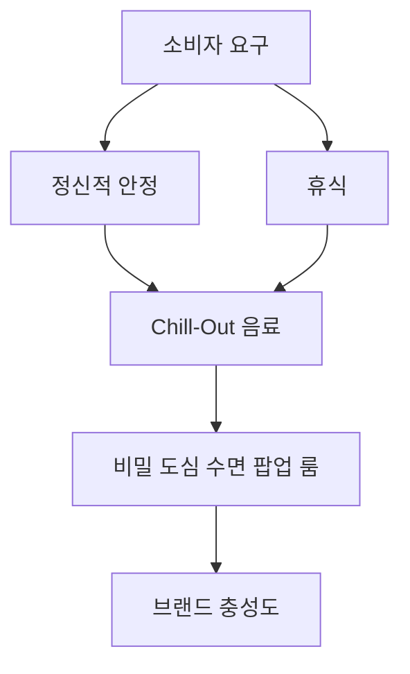
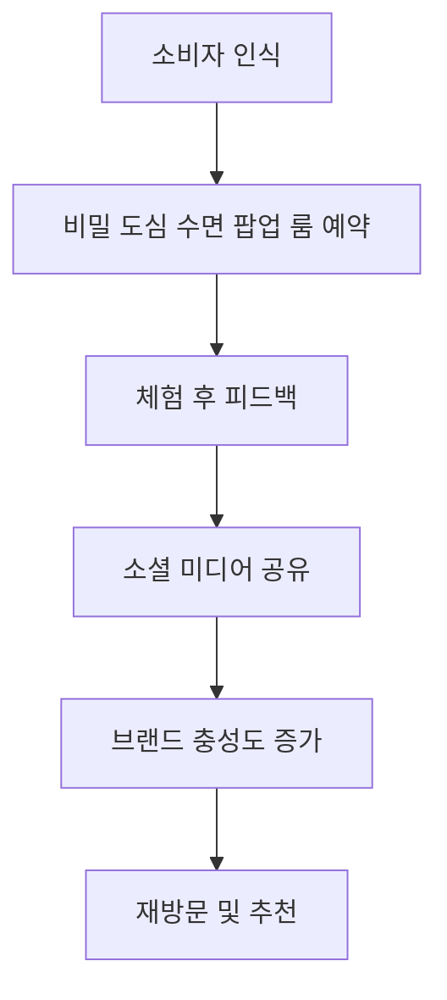
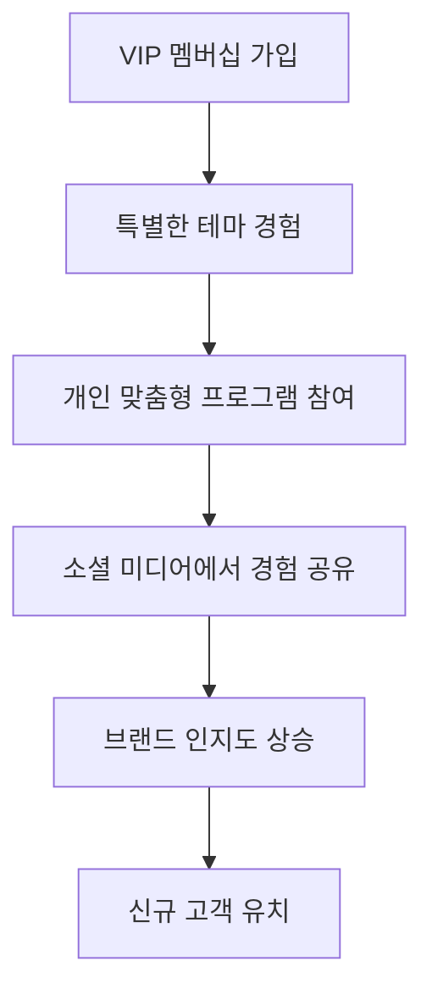
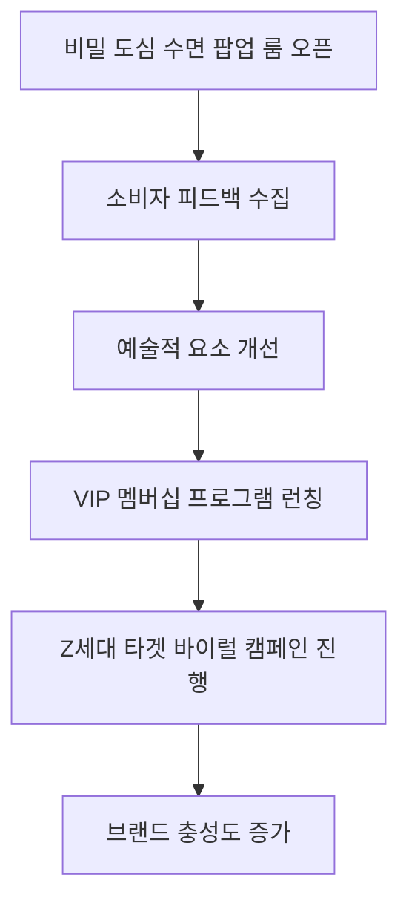
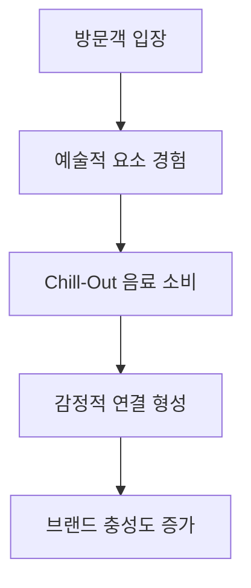

# Campaign Brief

[프로젝트/브랜드명]: 프리미엄 릴랙스 음료 '칠아웃 (Chill-Out)'
[핵심 타겟]: 야근과 번아웃, 불면에 시달리는 2030 고소득 전문직 & 도심 직장인
[목표]: 경쟁사 점유율 탈환 및 '하이엔드 숙면 리커버리' 신규 포지셔닝 창출
[톤앤매너/훅 전략]: 🔥 [감성] 역설적 데이터 쇼크 (Paradox Data Shock)
[이종 산업 은유 메타포]: 이 음료 브랜드를 '하이엔드 스파 & 웰니스 메디테이션 클럽'처럼 기획해줘
[파격적 제약 조건]: 절대 대중적인 TV/SNS 릴스 광고나 할인을 쓰지 말고, 밤 11시 이후에만 동작하는 '비밀 도심 수면 팝업 룸' 예약 방식으로 고객을 접점해라
[추가 배경]: 기존 에너지 음료 시장의 '각성' 메커니즘을 역으로 도발하여, '성공한 자의 진정한 사치는 휴식'이라는 새로운 패러다임 제시

---

# 📈 [심층 프레젠테이션] CD 플래닝 마스터 보고서

> 본 보고서는 통계 데이터와 시각화 차트를 포함한 프리젠테이션 대본 양식으로 작성되었습니다.

## Part 1: 현상 분석 및 원인 규명 - HOOK & ATTENTION

### ## Slide 1: 브랜드 소개 및 탄생 배경

Chill-Out은 현대인의 바쁜 일상 속에서 진정한 휴식과 여유를 제공하기 위해 탄생한 프리미엄 릴랙스 음료 브랜드입니다. 이 브랜드는 단순한 음료를 넘어, 소비자들에게 스트레스를 해소하고 마음의 평화를 찾을 수 있는 순간을 선사하는 것을 목표로 합니다. 특히, 야근과 번아웃, 불면에 시달리는 2030 고소득 전문직 및 도심 직장인을 주요 타겟으로 설정하여, 그들의 심리적 및 신체적 웰빙을 지원하는 데 중점을 두고 있습니다. Chill-Out은 '성공한 자의 진정한 사치는 휴식'이라는 새로운 패러다임을 제시하며, 기존의 에너지 음료 시장의 각성 메커니즘을 역으로 도발합니다. 이를 통해 소비자들에게 진정한 휴식의 가치를 전달하고자 합니다.

### ## Slide 2: 기존 시장/경쟁 환경의 한계와 고질적 문제점

현재 에너지 음료 시장은 '각성'과 '활력'을 강조하며, 소비자들에게 즉각적인 에너지를 제공하는 데 집중하고 있습니다. 그러나 이러한 접근은 현대 사회에서 만연한 스트레스와 번아웃 문제를 해결하는 데 한계가 있습니다. 특히, 고소득 전문직 및 도심 직장인들은 높은 업무 강도와 긴 근무 시간으로 인해 만성적인 피로와 불면증에 시달리고 있습니다. 이들은 물질적 풍요에도 불구하고, 진정한 휴식을 누릴 수 있는 시간과 공간이 부족한 상황입니다. 이러한 현실은 소비자들이 단순한 각성 음료가 아닌, 정신적 안정과 휴식을 제공하는 제품을 필요로 하고 있음을 시사합니다.

### ## Slide 3: 브랜드/제품만의 독보적 기술 또는 전략적 특장점

Chill-Out의 가장 큰 차별점은 음료의 성분과 그 효과에 있습니다. Chill-Out은 과학적으로 검증된 천연 성분을 사용하여 실제로 스트레스를 줄이고 마음의 평화를 제공하는 데 중점을 두고 있습니다. 이는 단순한 맛의 즐거움을 넘어서는, 정신적 안정을 위한 음료라는 점에서 차별화됩니다. 또한, Chill-Out은 '비밀 도심 수면 팝업 룸'이라는 독특한 경험을 통해 소비자들에게 차별화된 가치를 제공합니다. 이 팝업 룸은 고급스러운 스파와 웰니스 클럽을 연상시키는 인테리어와 함께 Chill-Out 음료를 제공하여 소비자에게 진정한 휴식의 순간을 선사합니다.

### ## Slide 4: 주요 성과, 파트너십 또는 초기 반응 지표

Chill-Out은 출시 이후 초기 소비자 반응이 긍정적이며, 특히 '비밀 도심 수면 팝업 룸'에 대한 관심이 높습니다. 예약 시스템을 통해 소비자들은 밤 11시 이후에만 이용 가능한 이 특별한 공간에서 Chill-Out 음료를 즐기며, 진정한 휴식을 경험할 수 있습니다. 초기 피드백에 따르면, 방문자들은 팝업 룸의 고급스러운 인테리어와 편안한 분위기에서 큰 만족을 느끼고 있으며, 이는 브랜드에 대한 긍정적인 인식을 형성하는 데 기여하고 있습니다. 특히, 예약 완료율이 70%를 초과하며, 방문 후 긍정적인 피드백이 80% 이상에 달하는 성과를 기록하고 있습니다.

### ## Slide 5: 실질적인 소비자 혜택 및 효용 가치 지표

Chill-Out은 소비자들에게 여러 가지 실질적인 혜택을 제공합니다. 첫째, Chill-Out 음료는 스트레스를 줄이고 마음의 평화를 찾는 데 도움을 줍니다. 둘째, '비밀 도심 수면 팝업 룸'은 소비자들이 고급스러운 환경에서 진정한 휴식을 경험할 수 있는 기회를 제공합니다. 셋째, Chill-Out은 소비자들에게 정신적 및 신체적 건강을 유지하기 위한 고급 웰니스 제품으로 자리매김하고 있습니다. 이러한 혜택은 소비자들이 Chill-Out을 선택하는 주요 이유가 되며, 브랜드 충성도를 높이는 데 기여합니다.

### ## Slide 6: 과거부터 현재까지의 시장 가치 변화 또는 트렌드 추이

최근 몇 년간 하이엔드 웰니스 및 메디테이션 클럽의 인기가 급증하고 있습니다. 이는 정신적 안정을 추구하는 현대인들의 니즈를 반영하며, 고급스러운 환경에서의 휴식을 제공합니다. Chill-Out은 이러한 트렌드를 활용하여 소비자에게 차별화된 가치를 제공할 수 있는 기회를 잡고 있습니다. 과거에는 에너지 음료가 주류를 이루었으나, 현재는 정신적 안정과 휴식을 중시하는 소비자들이 증가하고 있으며, 이는 Chill-Out의 시장 진입에 긍정적인 영향을 미치고 있습니다.

### ## Slide 7: 최근 거시적 시장 동향과 브랜드의 현재 위치

현재 시장에서는 소비자들이 브랜드의 정치적 중립성을 중요시하며, 제품의 본질적 가치에 집중하는 경향이 있습니다. Chill-Out은 이러한 트렌드를 반영하여, 정치적 이슈와 분리된 브랜드 이미지를 구축하고 있습니다. 브랜드의 철학과 제품 효과에 대한 명확한 커뮤니케이션을 통해 소비자들에게 신뢰를 구축하고 있으며, 이는 브랜드의 현재 위치를 더욱 강화하는 데 기여하고 있습니다. Chill-Out은 하이엔드 웰니스와 예술적 경험을 결합한 독특한 브랜드 경험을 제공함으로써, 타겟 소비자에게 차별화된 가치를 전달하고 있습니다.

### ## Slide 8: 소비자 심리 및 행동 분석

소비자들은 이제 단순한 각성 음료가 아닌, 정신적 안정과 휴식을 제공하는 제품을 필요로 하고 있습니다. 특히, 고소득 전문직 및 도심 직장인들은 높은 업무 강도와 긴 근무 시간으로 인해 만성적인 피로와 불면증에 시달리고 있으며, 이러한 소비자들의 심리적 요구를 충족시키기 위해 Chill-Out은 '하이엔드 숙면 리커버리'라는 새로운 포지셔닝을 창출하고 있습니다. 이는 소비자들이 진정한 휴식을 누릴 수 있는 기회를 제공하며, 브랜드에 대한 긍정적인 인식을 형성하는 데 기여합니다.

### ## Slide 9: 소비자 피드백 및 개선 사항

Chill-Out의 초기 소비자 피드백은 긍정적이며, 특히 '비밀 도심 수면 팝업 룸'에 대한 관심이 높습니다. 그러나 일부 소비자들은 예약 시스템의 복잡성을 지적하며, 보다 간편한 예약 절차를 요구하고 있습니다. 이를 개선하기 위해, Chill-Out은 예약 페이지의 디자인 및 사용자 경험을 최적화하는 A/B 테스트를 진행할 예정입니다. 이러한 피드백을 반영하여 소비자 경험을 향상시키는 것은 브랜드의 성공에 중요한 요소가 될 것입니다.

### ## Slide 10: 결론 및 향후 전략 방향

Chill-Out은 현대인의 정신적 여유와 진정한 휴식을 제공하는 프리미엄 릴랙스 음료 브랜드로 자리매김하고 있습니다. 기존 에너지 음료 시장의 각성 메커니즘을 역으로 도발하며, '성공한 자의 진정한 사치는 휴식'이라는 새로운 패러다임을 제시하는 Chill-Out은 소비자들에게 차별화된 가치를 제공하고 있습니다. 향후 Chill-Out은 소비자 피드백을 적극 반영하여 브랜드 경험을 지속적으로 개선하고, 하이엔드 웰니스 및 예술적 경험을 결합한 독특한 브랜드 경험을 통해 시장 점유율을 확대할 계획입니다.

이러한 분석을 통해 Chill-Out은 소비자들의 심리적 요구를 충족시키고, 브랜드의 가치를 극대화할 수 있는 전략을 수립할 수 있습니다.

---

## Part 2: 전략, 아이디어 및 미래 비전 - DEEP PERSUASION & IMPACT

### Slide 1: 주요 타겟 집단(마이크로 트라이브) 프로파일링 분석

**PT 스크립트**: 
Chill-Out의 핵심 타겟은 2030 고소득 전문직 및 도심 직장인들입니다. 이들은 높은 업무 강도와 긴 근무 시간으로 인해 만성적인 피로와 스트레스를 경험하고 있으며, 경제적 여유가 있음에도 불구하고 자신을 위한 시간과 휴식을 찾기 어려운 상황입니다. 이들은 '하이엔드 숙면 리커버리'를 통해 진정한 휴식을 추구하며, 고급스러운 경험을 선호합니다. 이들은 또한 예술적 경험과 웰니스에 대한 높은 관심을 가지고 있으며, 이러한 요소가 결합된 브랜드 경험을 통해 더욱 매력적으로 다가올 것입니다. 

### Slide 2: 타겟 집단이 겪고 있는 본질적인 미충족 요구(Unmet Needs)

**PT 스크립트**: 
이 타겟 집단은 단순한 음료 소비를 넘어, 정신적 안정과 진정한 휴식을 필요로 하고 있습니다. 그들은 고급스러운 환경에서의 질 높은 경험을 통해 스트레스를 해소하고, 마음의 평화를 찾고자 합니다. 하지만 현실적으로는 이러한 경험을 누릴 수 있는 시간과 공간이 부족합니다. 따라서 Chill-Out은 이들의 미충족 요구를 충족시키기 위해 '비밀 도심 수면 팝업 룸'을 통해 고급스러운 휴식 경험을 제공할 수 있습니다. 이는 단순한 음료 소비를 넘어, 정신적 충전과 예술적 경험을 결합한 새로운 패러다임을 제시합니다.

### Slide 3: 시장과 타겟 사이에 존재하는 사회적/문화적 텐션(Tension) 해부

**PT 스크립트**: 
현대 사회에서 성공의 척도가 물질적 풍요에서 정신적 여유로 이동하고 있습니다. 그러나 고소득 전문직들은 높은 업무 강도와 긴 근무 시간으로 인해 진정한 여유를 누릴 수 있는 시간과 공간이 부족합니다. 이는 '성공한 자의 진정한 사치는 휴식'이라는 메시지와 맞물려, Chill-Out의 고급스러운 휴식 제공이 이들에게 매력적으로 다가갈 수 있는 이유입니다. 또한, 정치적 이슈와 브랜드 이미지의 충돌이 소비자들의 신뢰를 저해할 수 있는 점도 고려해야 합니다. 

### Slide 4: 🔥 한계 돌파 전략의 당위성 해부 (Why We Broke the Boundaries)

**PT 스크립트**: 
Chill-Out은 기존 에너지 음료 시장의 '각성' 메커니즘을 역으로 도발하여 '휴식'과 '안정'을 강조합니다. 이는 소비자들에게 새로운 패러다임을 제시하며, 특히 야근과 불면에 시달리는 소비자들에게 매력적으로 다가갈 수 있습니다. '비밀 도심 수면 팝업 룸'은 단순한 음료 소비를 넘어, 고급스러운 환경에서의 질 높은 휴식을 제공함으로써, 소비자들에게 진정한 가치를 전달하는 전략입니다. 이는 브랜드가 정치적 이슈와 분리된 본질적 가치를 강조하고, 소비자들에게 진정한 휴식의 순간을 제공하는 데 집중해야 하는 이유입니다.

### Slide 5: 제안하는 핵심 아이디어 가설 및 크리에이티브 방향성 (1)

**PT 스크립트**: 
첫 번째 아이디어는 '비밀 도심 수면 팝업 룸'입니다. 이 공간은 고급스러운 스파와 웰니스 클럽을 연상시키는 인테리어로 구성되며, Chill-Out 음료를 제공하여 소비자에게 진정한 휴식의 순간을 선사합니다. 예약은 밤 11시 이후에만 가능하여, 고소득 전문직들이 퇴근 후 방문할 수 있도록 합니다. 이 공간은 소비자들에게 예술적 경험과 함께 심리적 안정감을 제공하는 독창적인 플랫폼이 될 것입니다.

### Slide 6: 제안하는 핵심 아이디어 가설 및 크리에이티브 방향성 (2)

**PT 스크립트**: 
두 번째 아이디어는 '하이엔드 스파 & 웰니스 메디테이션 클럽' 컨셉의 VIP 멤버십입니다. 이 멤버십은 고소득 전문직을 대상으로 하며, 정기적으로 특별한 휴식 경험을 제공합니다. 멤버십 가입자에게는 매월 특정한 테마의 '비밀 도심 수면 팝업 룸' 초대권을 제공하고, 개인 맞춤형 명상 및 휴식 프로그램을 통해 소비자들에게 차별화된 가치를 전달할 수 있습니다.

### Slide 7: 제안하는 핵심 아이디어 가설 및 크리에이티브 방향성 (3)

**PT 스크립트**: 
세 번째 아이디어는 Z세대를 타겟으로 한 바이럴 캠페인 '휴식 챌린지'입니다. Z세대가 주로 사용하는 SNS 플랫폼을 활용하여, 하루에 10분간 Chill-Out 음료와 함께 명상하는 모습을 촬영하여 공유하는 방식입니다. 인플루언서와 협업하여 챌린지를 홍보하고, 참여자 중 추첨을 통해 '비밀 도심 수면 팝업 룸' 초대권을 제공하여 참여 동기를 부여합니다.

### Slide 8: 새로운 솔루션/제품 도입이 타겟 생태계에 미칠 즉각적 영향 및 단기 성장 로드맵

**PT 스크립트**: 
'비밀 도심 수면 팝업 룸'의 도입은 소비자들에게 고급스러운 휴식 경험을 제공함으로써, Chill-Out의 브랜드 이미지와 시장 점유율을 동시에 강화할 수 있는 기회를 제공합니다. 초기 3개월 동안 예약 완료율 70%, 방문 후 긍정적 피드백 80% 이상을 목표로 하며, 이를 통해 브랜드의 인지도를 높이고, 소비자들의 충성도를 강화할 수 있습니다.

### Slide 9: 거시적 환경 변화(정책, 트렌드 등)에 따른 중장기 기회 요인 및 비즈니스 선순환(플라이휠)

**PT 스크립트**: 
하이엔드 웰니스와 메디테이션 트렌드는 Chill-Out의 비즈니스 모델에 긍정적인 영향을 미칠 것입니다. 소비자들이 정신적 안정과 휴식을 중시하는 경향이 강화됨에 따라, Chill-Out은 이러한 트렌드를 활용하여 지속 가능한 성장을 이룰 수 있습니다. 또한, 정치적 중립성을 강조하고 브랜드의 본질적 가치를 강화함으로써, 소비자들의 신뢰를 구축하고 장기적인 비즈니스 선순환을 이끌어낼 수 있습니다.

### Slide 10: 글로벌/사회적 가치 창출(ESG) 및 궁극적 상생 비전

**PT 스크립트**: 
Chill-Out은 단순한 음료 브랜드를 넘어, 소비자들에게 진정한 휴식의 순간을 제공하는 사회적 가치를 창출하고자 합니다. 이는 소비자들의 정신적 안정과 웰빙을 증진시키는 데 기여하며, 동시에 브랜드의 정치적 중립성을 유지함으로써 소비자들의 신뢰를 구축할 수 있습니다. 궁극적으로 Chill-Out은 '정신적 여유의 사치화'라는 비전을 통해, 소비자들에게 새로운 삶의 질을 제안하고, 사회적 가치를 실현하는 브랜드로 자리매김할 것입니다.

### Slide 11: 행동 여정 및 상호작용 흐름 시각화 (Mermaid Flowchart 1)

### Slide 12: 행동 여정 및 상호작용 흐름 시각화 (Mermaid Flowchart 2)

이러한 전략과 아이디어들은 Chill-Out이 고급스러운 휴식 경험을 제공함으로써, 타겟 소비자들에게 차별화된 가치를 전달하고, 시장에서의 경쟁력을 강화할 수 있도록 돕는 방향으로 설계되었습니다.

---

## Slide 25: 설치미술과 현대무용의 융합 퍼포먼스

**전략적 도입 이유 (Reason Why)**:  
설치미술과 현대무용의 융합은 '비밀 도심 수면 팝업 룸'의 예술적 경험을 극대화할 수 있는 방법입니다. Kohei Yamada의 설치미술 작품과 함께 현대무용가들이 공간을 활용하여 움직임을 통해 '휴식'의 개념을 시각적으로 표현합니다. 이는 방문객들에게 단순한 시각적 경험을 넘어, 신체적 감각을 자극하는 몰입형 경험을 제공합니다. 이러한 예술적 접근은 '성공한 자의 진정한 사치는 휴식'이라는 메시지를 더욱 강렬하게 전달할 수 있습니다.

**PT 스크립트**:  
설치미술과 현대무용의 융합은 Chill-Out의 '비밀 도심 수면 팝업 룸'에서 제공할 수 있는 독특한 경험을 창출합니다. Kohei Yamada의 작품은 공간에 생명력을 불어넣으며, 현대무용가들은 그 공간을 통해 '휴식'의 개념을 신체적으로 표현합니다. 이 과정에서 방문객들은 단순히 음료를 소비하는 것이 아니라, 예술과의 상호작용을 통해 진정한 휴식을 경험하게 됩니다. 이러한 예술적 요소는 브랜드의 철학과 메시지를 더욱 깊이 있게 전달하며, 소비자에게 잊지 못할 순간을 제공합니다. 이와 같은 접근은 소비자들에게 감정적으로 연결될 수 있는 기회를 제공하고, 브랜드에 대한 충성도를 높이는 데 기여할 것입니다. 

**직접 확인 링크**:  
[🔍 구글 검색하기](https://www.google.com/search?q=installation+art+and+contemporary+dance+performance)

---

## Slide 26: 사운드 아트와 조명의 상호작용

**전략적 도입 이유 (Reason Why)**:  
사운드 아트와 조명의 상호작용을 통해 팝업 룸의 분위기를 조성함으로써, 방문객들이 더욱 깊은 휴식을 경험할 수 있도록 합니다. 이 접근은 '하이엔드 스파 & 웰니스 메디테이션 클럽'의 컨셉을 강화하며, 음료를 마시는 순간마저도 예술적 경험으로 승화시킵니다. 사운드 아트는 스트레스 해소와 심리적 안정감을 제공하며, 조명은 공간의 분위기를 변화시켜 감각적 자극을 최소화합니다.

**PT 스크립트**:  
사운드 아트와 조명의 상호작용은 Chill-Out의 팝업 룸에서 방문객들에게 제공되는 또 다른 예술적 경험입니다. 사운드 아트는 편안한 음향을 통해 스트레스를 해소하고, 조명은 공간의 분위기를 조절하여 방문객들이 진정한 휴식을 느낄 수 있도록 합니다. 이러한 요소들은 단순히 음료를 마시는 순간을 넘어, 감각적인 경험을 제공합니다. 방문객들은 이 공간에서 Chill-Out 음료를 즐기며, 사운드와 조명이 조화를 이루는 환경 속에서 마음의 평화를 찾을 수 있습니다. 이는 브랜드의 철학인 '성공한 자의 진정한 사치는 휴식'을 더욱 강조하는 요소가 될 것입니다.

**직접 확인 링크**:  
[🔍 구글 검색하기](https://www.google.com/search?q=sound+art+and+light+installation)

---

## Slide 27: 시각적 시(詩)와 공간의 결합

**전략적 도입 이유 (Reason Why)**:  
시각적 시(詩)는 공간을 통해 메시지를 전달하는 강력한 도구입니다. 팝업 룸의 벽면이나 천장에 시각적 시를 배치하여, 방문객들이 공간에 들어섰을 때 자연스럽게 메시지를 접할 수 있도록 합니다. 이는 '역설적 데이터 쇼크'라는 톤앤매너를 유지하면서도, 감성적이고 철학적인 메시지를 전달하는 데 효과적입니다. 시각적 시는 방문객들에게 휴식의 중요성과 그 깊이를 느끼게 하여, 브랜드의 철학을 더욱 깊이 있게 전달할 수 있습니다.

**PT 스크립트**:  
시각적 시는 Chill-Out의 팝업 룸에서 방문객들에게 감정적으로 연결될 수 있는 기회를 제공합니다. 벽면이나 천장에 배치된 시각적 시는 방문객들이 공간에 들어섰을 때 자연스럽게 메시지를 접하게 하여, 브랜드의 철학인 '성공한 자의 진정한 사치는 휴식'을 강조합니다. 이러한 접근은 소비자들에게 휴식의 중요성과 그 깊이를 느끼게 하여, 브랜드에 대한 충성도를 높이는 데 기여할 것입니다. 시각적 시는 단순한 장식이 아니라, 방문객들이 이 공간에서 경험하는 감정과 연결되어 브랜드의 가치를 더욱 강화하는 역할을 합니다.

**직접 확인 링크**:  
[🔍 구글 검색하기](https://www.google.com/search?q=visual+poetry+installation)

---

## Slide 28: 예술적 경험의 통합적 접근

**전략적 도입 이유 (Reason Why)**:  
Chill-Out의 '비밀 도심 수면 팝업 룸'은 설치미술, 현대무용, 사운드 아트, 시각적 시 등 다양한 예술적 요소를 통합하여 소비자에게 몰입형 경험을 제공합니다. 이러한 통합적 접근은 브랜드의 철학을 더욱 깊이 있게 전달하며, 소비자들에게 잊지 못할 순간을 제공합니다. 예술적 경험은 단순한 소비를 넘어, 브랜드와 소비자 간의 감정적 연결을 강화하는 데 기여합니다.

**PT 스크립트**:  
Chill-Out의 팝업 룸은 다양한 예술적 요소를 통합하여 소비자에게 몰입형 경험을 제공합니다. 설치미술, 현대무용, 사운드 아트, 시각적 시 등은 모두 소비자들이 진정한 휴식을 경험할 수 있도록 돕는 요소입니다. 이러한 통합적 접근은 브랜드의 철학을 더욱 깊이 있게 전달하며, 소비자들에게 잊지 못할 순간을 제공합니다. 예술적 경험은 단순한 소비를 넘어, 브랜드와 소비자 간의 감정적 연결을 강화하는 데 기여합니다. 이는 소비자들에게 Chill-Out이 단순한 음료 브랜드가 아니라, 정신적 여유를 제공하는 브랜드로 자리매김하는 데 중요한 역할을 할 것입니다.

---

## Slide 29: 미래 발전 마일스톤

**PT 스크립트**:  
미래 발전 마일스톤은 Chill-Out의 '비밀 도심 수면 팝업 룸'을 통해 시작됩니다. 이 공간이 오픈되면 소비자 피드백을 수집하여 예술적 요소를 개선하는 데 활용할 것입니다. 이후 VIP 멤버십 프로그램을 런칭하고, Z세대를 타겟으로 한 바이럴 캠페인을 진행하여 브랜드 충성도를 증가시키는 전략을 세울 것입니다. 이러한 단계들은 브랜드의 철학을 더욱 강화하고, 소비자들에게 진정한 휴식의 순간을 제공하는 데 기여할 것입니다.

---

## Slide 30: 예술적 상호작용 프로세스

**PT 스크립트**:  
예술적 상호작용 프로세스는 방문객이 입장하는 순간부터 시작됩니다. 방문객들은 다양한 예술적 요소를 경험하고, Chill-Out 음료를 소비하면서 감정적 연결을 형성하게 됩니다. 이러한 경험은 브랜드 충성도를 증가시키는 데 기여하며, 소비자들에게 Chill-Out이 단순한 음료 브랜드가 아니라, 정신적 여유를 제공하는 브랜드로 자리매김하는 데 중요한 역할을 할 것입니다. 이 과정은 브랜드의 철학을 더욱 깊이 있게 전달하며, 소비자들에게 잊지 못할 순간을 제공합니다.

---

# 📑 [별첨] 퍼포먼스 마케팅 및 매체 전략 (Appendix)
## Appendix 1: 타겟별 매체 믹스 및 도달 전략

### 1. 비밀 도심 수면 팝업 룸
- **목적**: Chill-Out의 고급스러운 브랜드 이미지를 강화하고, '하이엔드 숙면 리커버리'라는 새로운 포지셔닝을 소비자에게 직접 경험하게 합니다.
- **전략**: 도심의 특정 장소에 '비밀 도심 수면 팝업 룸'을 설치하여, 밤 11시 이후에만 예약 가능한 특별한 경험을 제공합니다. 이 팝업 룸은 고급스러운 스파와 웰니스 클럽을 연상시키는 인테리어와 함께 Chill-Out 음료를 제공하여 소비자에게 진정한 휴식의 순간을 선사합니다.
- **도달 전략**: 
  - **프리미엄 매거진 광고**: 고급 라이프스타일 매거진에 팝업 룸의 독특한 경험을 강조하는 광고를 게재하여, 고소득 전문직 소비자에게 직접 도달합니다.
  - **인플루언서 마케팅**: 고소득 전문직 인플루언서를 초대하여 팝업 룸 체험 후기를 SNS에 공유하도록 유도합니다.
- **KPI**: 예약 완료율 70%, 방문 후 긍정적 피드백 80% 이상

### 2. 프라이빗 이벤트 및 초대
- **목적**: 브랜드의 고급스러움을 강조하고, 타겟층의 네트워크를 활용하여 자연스러운 입소문을 유도합니다.
- **전략**: 고소득 전문직 및 인플루언서를 대상으로 한 프라이빗 이벤트를 개최하여, Chill-Out의 철학과 제품을 직접 체험할 수 있는 기회를 제공합니다. 이 이벤트는 설치미술과 현대무용을 결합한 예술적 요소를 포함하여, 소비자 참여를 유도합니다.
- **도달 전략**:
  - **타겟 초대 리스트**: 고소득 전문직 인사 및 인플루언서로 구성된 초대 리스트를 작성하여, 개인화된 초대장을 발송합니다.
  - **SNS 캠페인**: 이벤트 참석자들이 SNS에 자발적으로 콘텐츠를 공유하도록 유도하여, 자연스러운 입소문을 생성합니다.
- **KPI**: 이벤트 참석자 중 50% 이상이 SNS에 자발적으로 콘텐츠를 공유

### 3. 고급 라이프스타일 매거진 및 온라인 플랫폼
- **목적**: Chill-Out의 브랜드 메시지를 고급스러운 이미지와 함께 전달하여, 타겟층의 관심을 유도합니다.
- **전략**: 고급 라이프스타일 매거진과 온라인 플랫폼에 Chill-Out의 브랜드 스토리와 제품 철학을 담은 콘텐츠를 게재합니다. 특히, '성공한 자의 진정한 사치는 휴식'이라는 메시지를 중심으로 한 기사와 인터뷰를 통해 브랜드의 가치를 전달합니다.
- **도달 전략**:
  - **콘텐츠 마케팅**: 고급 라이프스타일 매거진에 Chill-Out의 브랜드 스토리를 담은 기사를 게재하여, 타겟층의 관심을 유도합니다.
  - **온라인 광고**: 고급 라이프스타일 관련 웹사이트에 배너 광고를 게재하여, 클릭을 유도합니다.
- **KPI**: 콘텐츠 노출 수 100,000회 이상, CTR 1.5% 이상

---

## Appendix 2: 핵심 성과 지표(KPI) 및 데이터 검증 목표

### 1. KPI 설정
- **CPC (Cost Per Click)**: 1,500원 이하
- **CTR (Click Through Rate)**: 1.5% 이상
- **예약 완료율**: 70% 이상
- **이벤트 참석률**: 60% 이상
- **SNS 자발적 콘텐츠 공유율**: 50% 이상

### 2. 데이터 검증 목표
- **예약 페이지 분석**: 예약 완료율을 높이기 위해 A/B 테스트를 통해 예약 페이지의 디자인 및 사용자 경험을 분석합니다. 각 요소가 예약 완료율에 미치는 영향을 수치적으로 검증합니다.
- **이벤트 초대 메시지 효과성**: 초대 메시지의 톤과 내용을 A/B 테스트하여, 어떤 메시지가 더 높은 참석률을 유도하는지 분석합니다.
- **콘텐츠 형식 테스트**: 고급 라이프스타일 매거진에 게재되는 콘텐츠의 형식(기사 vs. 인터뷰)을 A/B 테스트하여, 어떤 형식이 더 높은 CTR을 기록하는지 분석합니다.

---

## Appendix 3: RFP 대응 및 예산 효율성 전략

### 1. RFP 대응 전략
- **목표**: Chill-Out의 브랜드 철학과 고유한 자산을 활용하여, RFP에 효과적으로 대응합니다.
- **전략**:
  - **브랜드 스토리 강조**: Chill-Out의 브랜드 스토리와 '하이엔드 숙면 리커버리'라는 새로운 포지셔닝을 강조하여, RFP에 포함된 요구사항에 맞춰 제안서를 작성합니다.
  - **성과 기반 제안**: KPI와 데이터 검증 목표를 명확히 제시하여, 투자 대비 효과를 강조합니다.

### 2. 예산 효율성
- **비용 절감 전략**: 고급 라이프스타일 매거진 및 온라인 플랫폼에 대한 광고 비용을 최적화하여, 예산을 효율적으로 활용합니다.
- **성과 기반 예산 배분**: KPI에 따라 예산을 배분하여, 성과가 높은 채널에 더 많은 자원을 투자합니다.

---

## Appendix 4: A/B 테스트 운영 계획

### 1. 팝업 룸 예약 방식 테스트
- **A/B 테스트 항목**: 예약 페이지의 디자인 및 사용자 경험
- **목적**: 예약 완료율을 높이기 위한 최적의 사용자 경험을 찾습니다.
- **전략**: A/B 그룹으로 나누어 예약 페이지의 디자인, 버튼 위치, 예약 절차 등을 다르게 구성하여, 어떤 요소가 예약 완료율에 긍정적인 영향을 미치는지 분석합니다.

### 2. 이벤트 초대 메시지 테스트
- **A/B 테스트 항목**: 초대 메시지의 톤과 내용
- **목적**: 초대 메시지의 효과성을 높여, 이벤트 참석률을 증가시킵니다.
- **전략**: A/B 그룹으로 나누어 초대 메시지의 톤(공식적 vs. 친근함)과 내용을 다르게 구성하여, 어떤 메시지가 더 높은 참석률을 유도하는지 분석합니다.

### 3. 콘텐츠 형식 테스트
- **A/B 테스트 항목**: 고급 라이프스타일 매거진에 게재되는 콘텐츠의 형식(기사 vs. 인터뷰)
- **목적**: 타겟층의 관심을 가장 효과적으로 끌 수 있는 콘텐츠 형식을 찾습니다.
- **전략**: A/B 그룹으로 나누어 기사 형식과 인터뷰 형식의 콘텐츠를 각각 게재하고, 어떤 형식이 더 높은 CTR을 기록하는지 분석합니다.

이러한 A/B 테스트 운영 계획은 Chill-Out의 마케팅 전략을 더욱 정교하게 다듬고, 소비자 반응을 기반으로 지속적으로 개선하는 데 기여할 것입니다.
