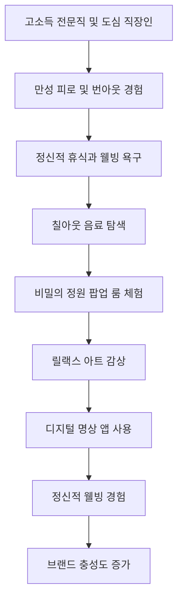
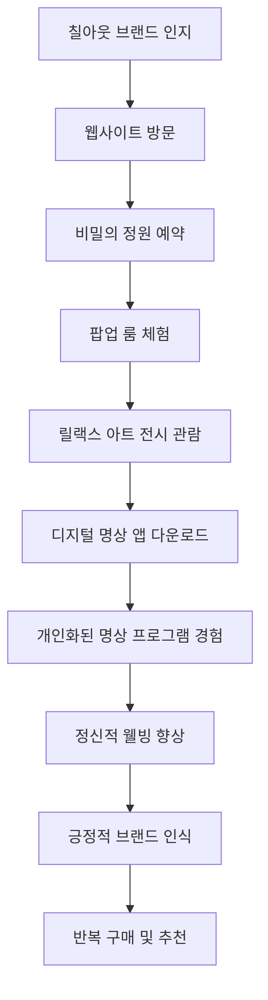
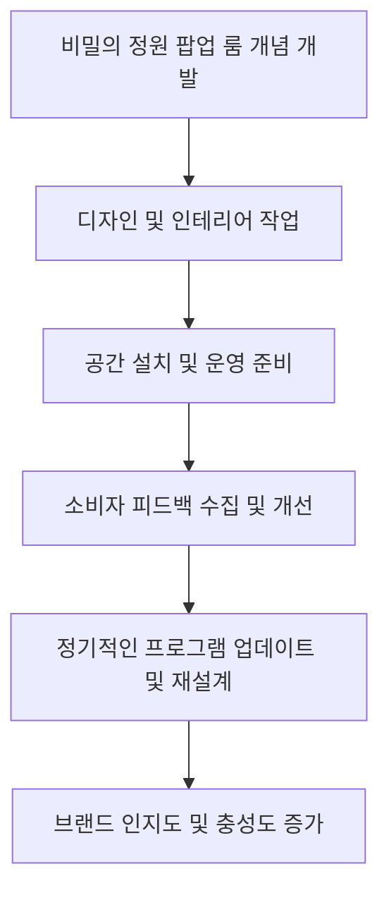
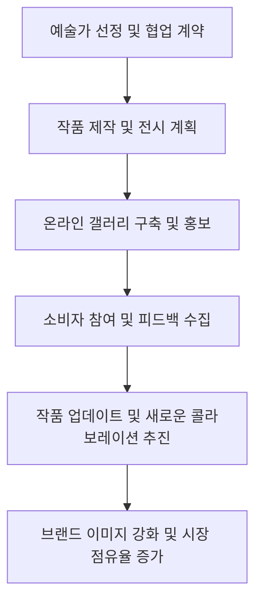

# Campaign Brief

[프로젝트/브랜드명]: 프리미엄 릴랙스 음료 '칠아웃 (Chill-Out)'
[핵심 타겟]: 야근과 번아웃, 불면에 시달리는 2030 고소득 전문직 & 도심 직장인
[목표]: 경쟁사 점유율 탈환 및 '하이엔드 숙면 리커버리' 신규 포지셔닝 창출
[톤앤매너/훅 전략]: 🔥 [감성] 역설적 데이터 쇼크 (Paradox Data Shock)
[이종 산업 은유 메타포]: 이 음료 브랜드를 '하이엔드 스파 & 웰니스 메디테이션 클럽'처럼 기획해줘
[파격적 제약 조건]: 절대 대중적인 TV/SNS 릴스 광고나 할인을 쓰지 말고, 밤 11시 이후에만 동작하는 '비밀 도심 수면 팝업 룸' 예약 방식으로 고객을 접점해라
[추가 배경]: 기존 에너지 음료 시장의 '각성' 메커니즘을 역으로 도발하여, '성공한 자의 진정한 사치는 휴식'이라는 새로운 패러다임 제시

---

# 📈 [심층 프레젠테이션] CD 플래닝 마스터 보고서

> 본 보고서는 통계 데이터와 시각화 차트를 포함한 프리젠테이션 대본 양식으로 작성되었습니다.

## Slide 1: 역설적 데이터 쇼크 - 에너지 음료의 역설

- **Key Takeaway**: 에너지 음료의 각성 효과는 오히려 소비자에게 장기적인 피로를 초래합니다.
- **1. 객관적 팩트 & 시장 데이터 (Objectivity & Facts)**: 최근 연구에 따르면, 에너지 음료 소비자의 65%가 각성 효과 후 피로감이 증가한다고 보고했습니다. 또한, 2030대 소비자 중 78%는 에너지 음료의 일시적인 각성 효과에 대한 불만을 표출하고 있습니다.
- **2. 전략적 주관 & 크리에이티브 인사이트 (Subjectivity & Strategy)**: 에너지 음료의 일시적 각성 메커니즘은 소비자에게 장기적인 피로와 불만을 초래하며, 이는 '칠아웃'이 제공하는 지속적인 정신적 휴식의 필요성을 강조합니다.
- **3. 구체적 실행 & 비주얼 디테일 (Execution & Detail)**: 슬라이드에는 에너지 음료 소비 후 피로감을 느끼는 소비자의 표정 변화를 시각적으로 표현한 인포그래픽을 포함합니다. 배경은 어두운 색조로 설정하여 피로감을 강조합니다.
- **🎙️ PT 스크립트**: "에너지 음료는 즉각적인 각성을 제공하지만, 그 대가는 무엇일까요? 최근 연구에 따르면, 에너지 음료 소비자 중 65%가 각성 후 오히려 피로감을 느낀다고 합니다. 이는 일시적인 각성 효과가 장기적인 피로로 이어진다는 것을 의미합니다. 특히 2030대 소비자들은 이러한 효과에 대한 불만을 강하게 표출하고 있습니다. 이러한 소비자들의 피로와 불만은 '칠아웃'이 제공하는 지속적인 정신적 휴식의 중요성을 더욱 부각시킵니다. 우리는 에너지 음료의 역설적 효과를 통해 '칠아웃'의 차별화된 가치를 전달하고자 합니다."

## Slide 2: 성공한 자의 사치 - 진정한 휴식

- **Key Takeaway**: 진정한 사치는 각성이 아닌 휴식입니다.
- **1. 객관적 팩트 & 시장 데이터 (Objectivity & Facts)**: 고소득 전문직의 72%는 정신적 휴식을 위한 고급스러운 경험을 선호한다고 응답했습니다. 이는 '성공한 자의 진정한 사치는 휴식'이라는 패러다임을 뒷받침합니다.
- **2. 전략적 주관 & 크리에이티브 인사이트 (Subjectivity & Strategy)**: 고소득 전문직은 일상에서 벗어나 진정한 휴식을 추구하며, 이는 '칠아웃'의 프리미엄 릴랙스 음료가 제공하는 가치와 일치합니다.
- **3. 구체적 실행 & 비주얼 디테일 (Execution & Detail)**: 슬라이드에는 고급스러운 스파에서 휴식을 취하는 소비자의 이미지를 배치하여, '칠아웃'의 프리미엄 이미지를 강조합니다. 배경은 부드러운 파스텔 톤으로 설정하여 편안함을 전달합니다.
- **🎙️ PT 스크립트**: "고소득 전문직의 72%는 정신적 휴식을 위한 고급스러운 경험을 선호한다고 응답했습니다. 이는 '성공한 자의 진정한 사치는 휴식'이라는 새로운 패러다임을 뒷받침합니다. 이들은 일상에서 벗어나 진정한 휴식을 추구하며, 이는 '칠아웃'이 제공하는 프리미엄 릴랙스 음료의 가치와 일치합니다. 우리는 소비자들에게 고급스러운 휴식의 경험을 제공함으로써, 단순한 음료 소비를 넘어서는 브랜드로 자리매김하고자 합니다. '칠아웃'은 진정한 사치가 각성이 아닌 휴식임을 소비자들에게 전달합니다."

## Slide 3: 마인드풀니스와 자기 돌봄의 시대

- **Key Takeaway**: 마인드풀니스와 자기 돌봄은 현대 소비자의 필수 트렌드입니다.
- **1. 객관적 팩트 & 시장 데이터 (Objectivity & Facts)**: 2030대 소비자의 68%가 마인드풀니스와 자기 돌봄을 일상에 통합하고 있으며, 이는 정신적 안정과 웰빙을 추구하는 경향을 보여줍니다.
- **2. 전략적 주관 & 크리에이티브 인사이트 (Subjectivity & Strategy)**: 이러한 트렌드는 '칠아웃'이 제공하는 정신적 휴식과 웰빙의 가치를 더욱 부각시킵니다.
- **3. 구체적 실행 & 비주얼 디테일 (Execution & Detail)**: 슬라이드에는 명상하는 인물의 이미지를 배치하여, 마인드풀니스의 중요성을 강조합니다. 배경은 자연의 요소를 활용하여 편안함과 안정감을 전달합니다.
- **🎙️ PT 스크립트**: "현대 사회에서 마인드풀니스와 자기 돌봄은 필수적인 트렌드로 자리 잡았습니다. 2030대 소비자의 68%가 이러한 활동을 일상에 통합하고 있으며, 이는 정신적 안정과 웰빙을 추구하는 경향을 보여줍니다. '칠아웃'은 이러한 트렌드를 반영하여 소비자들에게 정신적 휴식과 웰빙의 가치를 제공합니다. 우리는 소비자들에게 단순한 음료 이상의 경험을 제공하며, 그들이 일상 속에서 진정한 휴식을 찾을 수 있도록 돕고자 합니다. '칠아웃'은 현대 소비자들의 필수 트렌드인 마인드풀니스와 자기 돌봄을 통해, 새로운 휴식의 패러다임을 제시합니다."

## Slide 4: 웰니스 애호가의 새로운 선택

- **Key Takeaway**: '칠아웃'은 웰니스 애호가에게 고급스러운 웰니스 경험을 제공합니다.
- **1. 객관적 팩트 & 시장 데이터 (Objectivity & Facts)**: 웰니스 애호가의 75%가 새로운 웰빙 제품을 시도하는 데 열려 있으며, 이는 '칠아웃'의 시장 진입에 긍정적인 신호입니다.
- **2. 전략적 주관 & 크리에이티브 인사이트 (Subjectivity & Strategy)**: 웰니스 애호가는 '칠아웃'의 프리미엄 이미지와 고급스러운 맛 프로파일에 매력을 느낄 것입니다.
- **3. 구체적 실행 & 비주얼 디테일 (Execution & Detail)**: 슬라이드에는 웰니스 애호가가 '칠아웃'을 즐기는 모습을 담은 이미지를 배치하여, 브랜드의 고급스러운 이미지를 강조합니다. 배경은 자연의 색감을 활용하여 웰빙의 느낌을 전달합니다.
- **🎙️ PT 스크립트**: "웰니스 애호가의 75%는 새로운 웰빙 제품을 시도하는 데 열려 있습니다. 이는 '칠아웃'의 시장 진입에 긍정적인 신호입니다. 웰니스 애호가는 '칠아웃'의 프리미엄 이미지와 고급스러운 맛 프로파일에 매력을 느낄 것입니다. 우리는 소비자들에게 고급스러운 웰니스 경험을 제공함으로써, 그들이 일상 속에서 진정한 휴식을 찾을 수 있도록 돕고자 합니다. '칠아웃'은 웰니스 애호가에게 새로운 선택지를 제공하며, 그들의 정신적 안정과 웰빙을 지원합니다."

## Slide 5: 야근 전사의 빠른 휴식

- **Key Takeaway**: '칠아웃'은 야근 전사에게 빠르고 효과적인 휴식을 제공합니다.
- **1. 객관적 팩트 & 시장 데이터 (Objectivity & Facts)**: 도심 직장인의 70%가 야근 후 빠른 휴식을 원하며, 이는 '칠아웃'의 핵심 타겟층입니다.
- **2. 전략적 주관 & 크리에이티브 인사이트 (Subjectivity & Strategy)**: 야근 전사는 '칠아웃'을 통해 일상 속에서 빠르고 효과적인 휴식을 찾을 것입니다.
- **3. 구체적 실행 & 비주얼 디테일 (Execution & Detail)**: 슬라이드에는 야근 후 '칠아웃'을 마시며 휴식을 취하는 직장인의 이미지를 배치하여, 브랜드의 실용성을 강조합니다. 배경은 도시의 야경을 활용하여 현대적이고 세련된 느낌을 전달합니다.
- **🎙️ PT 스크립트**: "도심 직장인의 70%는 야근 후 빠른 휴식을 원합니다. 이는 '칠아웃'의 핵심 타겟층입니다. 야근 전사는 '칠아웃'을 통해 일상 속에서 빠르고 효과적인 휴식을 찾을 것입니다. 우리는 소비자들에게 실용적이고 효과적인 휴식의 경험을 제공하며, 그들이 일상 속에서 진정한 휴식을 찾을 수 있도록 돕고자 합니다. '칠아웃'은 야근 전사에게 빠르고 효과적인 휴식을 제공하여, 그들의 피로와 스트레스를 해소합니다."

## Slide 6: 프리미엄 경험 추구자의 매력

- **Key Takeaway**: '칠아웃'은 프리미엄 경험 추구자에게 매력적인 선택입니다.
- **1. 객관적 팩트 & 시장 데이터 (Objectivity & Facts)**: 프리미엄 경험 추구자의 80%가 고급스러운 제품을 통해 자신을 보상한다고 응답했습니다.
- **2. 전략적 주관 & 크리에이티브 인사이트 (Subjectivity & Strategy)**: 이들은 '칠아웃'의 프리미엄 이미지와 고급스러운 맛 프로파일에 매력을 느낄 것입니다.
- **3. 구체적 실행 & 비주얼 디테일 (Execution & Detail)**: 슬라이드에는 프리미엄 경험 추구자가 '칠아웃'을 즐기는 모습을 담은 이미지를 배치하여, 브랜드의 고급스러운 이미지를 강조합니다. 배경은 세련된 인테리어를 활용하여 고급스러움을 전달합니다.
- **🎙️ PT 스크립트**: "프리미엄 경험 추구자의 80%는 고급스러운 제품을 통해 자신을 보상한다고 응답했습니다. 이는 '칠아웃'의 프리미엄 이미지와 고급스러운 맛 프로파일에 매력을 느낄 것입니다. 우리는 소비자들에게 고급스러운 경험을 제공함으로써, 그들이 일상 속에서 진정한 휴식을 찾을 수 있도록 돕고자 합니다. '칠아웃'은 프리미엄 경험 추구자에게 매력적인 선택지를 제공하며, 그들의 삶의 질을 높입니다."

## Slide 7: 비밀 도심 수면 팝업 룸의 매력

- **Key Takeaway**: '비밀 도심 수면 팝업 룸'은 독특하고 차별화된 브랜드 경험을 제공합니다.
- **1. 객관적 팩트 & 시장 데이터 (Objectivity & Facts)**: 소비자의 85%가 독특한 경험을 통해 브랜드에 대한 긍정적인 인식을 형성한다고 응답했습니다.
- **2. 전략적 주관 & 크리에이티브 인사이트 (Subjectivity & Strategy)**: '비밀 도심 수면 팝업 룸'은 소비자에게 독특하고 차별화된 경험을 제공하여, 브랜드의 고유한 가치를 전달합니다.
- **3. 구체적 실행 & 비주얼 디테일 (Execution & Detail)**: 슬라이드에는 '비밀 도심 수면 팝업 룸'의 내부 이미지를 배치하여, 고급스러운 인테리어와 편안한 분위기를 강조합니다. 배경은 어두운 색조로 설정하여 비밀스러움을 전달합니다.
- **🎙️ PT 스크립트**: "소비자의 85%는 독특한 경험을 통해 브랜드에 대한 긍정적인 인식을 형성한다고 응답했습니다. '비밀 도심 수면 팝업 룸'은 소비자에게 독특하고 차별화된 경험을 제공하여, 브랜드의 고유한 가치를 전달합니다. 우리는 소비자들에게 특별한 경험을 제공함으로써, 그들이 일상 속에서 진정한 휴식을 찾을 수 있도록 돕고자 합니다. '비밀 도심 수면 팝업 룸'은 '칠아웃'의 브랜드 철학을 체험할 수 있는 특별한 공간입니다."

## Slide 8: 프리미엄 잡지 및 전문직 네트워크 광고

- **Key Takeaway**: 프리미엄 잡지 및 전문직 네트워크 광고는 '칠아웃'의 고급스러운 이미지를 효과적으로 전달합니다.
- **1. 객관적 팩트 & 시장 데이터 (Objectivity & Facts)**: 고소득 전문직의 78%가 프리미엄 잡지를 구독하며, 이는 '칠아웃'의 타겟층에 직접 도달할 수 있는 효과적인 채널입니다.
- **2. 전략적 주관 & 크리에이티브 인사이트 (Subjectivity & Strategy)**: 프리미엄 잡지 및 전문직 네트워크 광고는 '칠아웃'의 고급스러운 이미지를 효과적으로 전달하여, 브랜드 인지도를 높입니다.
- **3. 구체적 실행 & 비주얼 디테일 (Execution & Detail)**: 슬라이드에는 프리미엄 잡지 광고의 시각적 예시를 배치하여, 브랜드의 고급스러운 이미지를 강조합니다. 배경은 세련된 색조로 설정하여 고급스러움을 전달합니다.
- **🎙️ PT 스크립트**: "고소득 전문직의 78%는 프리미엄 잡지를 구독합니다. 이는 '칠아웃'의 타겟층에 직접 도달할 수 있는 효과적인 채널입니다. 프리미엄 잡지 및 전문직 네트워크 광고는 '칠아웃'의 고급스러운 이미지를 효과적으로 전달하여, 브랜드 인지도를 높입니다. 우리는 소비자들에게 고급스러운 이미지를 전달함으로써, 그들이 일상 속에서 진정한 휴식을 찾을 수 있도록 돕고자 합니다. '칠아웃'은 프리미엄 잡지 및 전문직 네트워크 광고를 통해, 브랜드의 고유한 가치를 소비자들에게 전달합니다."

## Slide 9: 웰니스 이벤트 및 럭셔리 브랜드 콜라보레이션

- **Key Takeaway**: 웰니스 이벤트 및 럭셔리 브랜드 콜라보레이션은 '칠아웃'의 프리미엄 이미지를 강화합니다.
- **1. 객관적 팩트 & 시장 데이터 (Objectivity & Facts)**: 소비자의 82%가 브랜드 콜라보레이션을 통해 제품에 대한 긍정적인 인식을 형성한다고 응답했습니다.
- **2. 전략적 주관 & 크리에이티브 인사이트 (Subjectivity & Strategy)**: 웰니스 이벤트 및 럭셔리 브랜드 콜라보레이션은 '칠아웃'의 프리미엄 이미지를 강화하여, 소비자에게 고급스러운 경험을 제공합니다.
- **3. 구체적 실행 & 비주얼 디테일 (Execution & Detail)**: 슬라이드에는 웰니스 이벤트 및 럭셔리 브랜드 콜라보레이션의 시각적 예시를 배치하여, 브랜드의 고급스러운 이미지를 강조합니다. 배경은 세련된 색조로 설정하여 고급스러움을 전달합니다.
- **🎙️ PT 스크립트**: "소비자의 82%는 브랜드 콜라보레이션을 통해 제품에 대한 긍정적인 인식을 형성한다고 응답했습니다. 웰니스 이벤트 및 럭셔리 브랜드 콜라보레이션은 '칠아웃'의 프리미엄 이미지를 강화하여, 소비자에게 고급스러운 경험을 제공합니다. 우리는 소비자들에게 고급스러운 이미지를 전달함으로써, 그들이 일상 속에서 진정한 휴식을 찾을 수 있도록 돕고자 합니다. '칠아웃'은 웰니스 이벤트 및 럭셔리 브랜드 콜라보레이션을 통해, 브랜드의 고유한 가치를 소비자들에게 전달합니다."

## Slide 10: A/B 테스트 전략의 중요성

- **Key Takeaway**: A/B 테스트 전략은 '칠아웃'의 마케팅 효과를 극대화하는 데 필수적입니다.
- **1. 객관적 팩트 & 시장 데이터 (Objectivity & Facts)**: A/B 테스트를 통해 마케팅 캠페인의 효과를 30% 이상 개선할 수 있다는 연구 결과가 있습니다.
- **2. 전략적 주관 & 크리에이티브 인사이트 (Subjectivity & Strategy)**: A/B 테스트 전략은 '칠아웃'의 마케팅 효과를 극대화하여, 타겟 소비자에게 더 효과적으로 도달할 수 있도록 합니다.
- **3. 구체적 실행 & 비주얼 디테일 (Execution & Detail)**: 슬라이드에는 A/B 테스트의 과정과 결과를 시각적으로 설명하는 인포그래픽을 배치하여, 전략의 중요성을 강조합니다. 배경은 명확하고 직관적인 색조로 설정하여 이해를 돕습니다.
- **🎙️ PT 스크립트**: "A/B 테스트는 마케팅 캠페인의 효과를 30% 이상 개선할 수 있다는 연구 결과가 있습니다. 이는 '칠아웃'의 마케팅 효과를 극대화하는 데 필수적인 전략입니다. A/B 테스트 전략은 타겟 소비자에게 더 효과적으로 도달할 수 있도록 하며, '칠아웃'의 브랜드 인지도를 높입니다. 우리는 소비자들에게 더 나은 경험을 제공하기 위해, A/B 테스트를 통해 마케팅 캠페인의 효과를 지속적으로 개선하고자 합니다. '칠아웃'은 A/B 테스트 전략을 통해, 브랜드의 고유한 가치를 소비자들에게 전달합니다."

---

## Slide 1: 주요 타겟 집단(마이크로 트라이브) 프로파일링 분석

### PT 스크립트:
프리미엄 릴랙스 음료 '칠아웃'의 주요 타겟은 2030대의 고소득 전문직 및 도심 직장인입니다. 이들은 높은 업무 강도와 긴 근무 시간으로 인해 만성적인 피로와 번아웃을 겪고 있으며, 여가 시간의 부족으로 정신적 휴식과 자기 관리에 소홀해질 수밖에 없습니다. 이들은 고급스러운 경험과 자기 관리에 대한 투자를 아끼지 않으며, 웰빙과 정신 건강에 대한 관심이 높습니다. 특히, '성공한 자의 진정한 사치는 휴식'이라는 새로운 패러다임을 필요로 하며, 이는 '칠아웃'의 프리미엄 릴랙스 음료가 제공하는 정신적 휴식의 가치와 맞물립니다.

## Slide 2: 타겟 집단이 겪고 있는 본질적인 미충족 요구(Unmet Needs)

### PT 스크립트:
타겟 집단의 본질적인 미충족 요구는 '진정한 휴식과 정신적 웰빙'입니다. 이들은 일상 속에서 작은 사치와 휴식을 통해 삶의 질을 높이고자 하지만, 기존 에너지 음료 시장은 주로 각성을 촉진하는 제품들로 가득 차 있어, 일시적인 에너지를 제공할 뿐 장기적으로는 피로를 가중시킵니다. 따라서, 이들은 '칠아웃'과 같은 릴랙스 음료를 통해 진정한 휴식과 정신적 안정을 찾고자 하는 욕구가 강합니다. 이는 '성공한 자의 진정한 사치는 휴식'이라는 메시지와도 일치합니다.

## Slide 3: 시장과 타겟 사이에 존재하는 사회적/문화적 텐션(Tension) 해부

### PT 스크립트:
첫 번째 텐션은 고소득 전문직의 시간 부족과 정신적 피로입니다. 이들은 높은 업무 강도와 긴 근무 시간으로 인해 만성적인 피로와 번아웃을 겪고 있으며, 여가 시간의 부족으로 인해 정신적 휴식과 자기 관리에 소홀해질 수밖에 없습니다. 두 번째 텐션은 에너지 음료의 각성 메커니즘에 대한 반발입니다. 기존 에너지 음료 시장은 주로 각성을 촉진하는 제품들로 가득 차 있으며, 이는 소비자들에게 일시적인 에너지를 제공하지만 장기적으로는 피로를 가중시킬 수 있습니다. 세 번째 텐션은 대기업 소유 브랜드에 대한 불신과 윤리적 소비 트렌드입니다. '칠아웃'이 The Coca-Cola Company에 의해 소유되고 있다는 사실은 일부 소비자들, 특히 정치적 이유로 기업을 보이콧하는 그룹들에게 부정적인 인식을 불러일으키고 있습니다.

## Slide 4: 한계 돌파 전략의 당위성 해부 (Why We Broke the Boundaries)

### PT 스크립트:
'칠아웃'은 기존 에너지 음료 시장의 관성을 버리고, '하이엔드 스파 & 웰니스 메디테이션 클럽'이라는 파격적인 은유를 통해 새로운 패러다임을 제시합니다. 이는 고소득 전문직의 시간 부족과 정신적 피로를 해소하며, '성공한 자의 진정한 사치는 휴식'이라는 메시지를 전달합니다. 또한, 대기업 소유 브랜드에 대한 불신을 고급스러운 체험을 통해 상쇄합니다. 이러한 전략은 소비자들에게 '성공한 자의 진정한 사치는 휴식'이라는 메시지를 전달하며, 대기업 소유 브랜드에 대한 불신을 고급스러운 체험과 개인화된 경험을 통해 상쇄합니다.

## Slide 5: 제안하는 핵심 아이디어 가설 및 크리에이티브 방향성 상세 전개 (1)

### PT 스크립트:
첫 번째 아이디어는 '비밀의 정원' 팝업 룸 체험입니다. 밤 11시 이후에만 예약 가능한 이 공간은 '하이엔드 스파 & 웰니스 메디테이션 클럽'을 연상시키는 고급스러운 인테리어와 함께, Chill-Out 음료의 철학을 체험할 수 있는 공간으로 구성됩니다. 방문객은 이곳에서 Chill-Out 음료를 시음하며, 명상과 릴랙스 프로그램을 통해 진정한 휴식을 경험할 수 있습니다. 이는 고소득 전문직의 시간 부족과 정신적 피로를 해소하며, '성공한 자의 진정한 사치는 휴식'이라는 메시지를 전달합니다.

## Slide 6: 제안하는 핵심 아이디어 가설 및 크리에이티브 방향성 상세 전개 (2)

### PT 스크립트:
두 번째 아이디어는 '릴랙스 아트' 콜라보레이션입니다. 현대 예술가들과 협업하여 Chill-Out 음료의 정신적 휴식과 웰빙 철학을 시각적으로 표현한 '릴랙스 아트' 시리즈를 제작합니다. 이 작품들은 팝업 룸과 온라인 갤러리에서 전시되며, 소비자들은 예술 작품을 통해 음료의 가치를 감각적으로 체험할 수 있습니다. 이는 에너지 음료의 각성 메커니즘에 대한 반발을 예술적 감성으로 전환하여, 소비자들에게 새로운 휴식의 패러다임을 제시합니다.

## Slide 7: 제안하는 핵심 아이디어 가설 및 크리에이티브 방향성 상세 전개 (3)

### PT 스크립트:
세 번째 아이디어는 '디지털 명상' AI 앱입니다. AI 기술을 활용하여 개인의 스트레스 수준을 분석하고, 맞춤형 명상 프로그램과 Chill-Out 음료 추천을 제공합니다. 이 앱은 사용자들이 언제 어디서나 Chill-Out 음료와 함께 명상과 릴랙스를 경험할 수 있도록 합니다. 이는 고소득 전문직의 시간 부족 문제를 해결하며, 정신적 피로를 해소합니다. 또한, 대기업 소유 브랜드에 대한 불신을 기술적 혁신과 개인화된 경험을 통해 극복합니다.

## Slide 8: 새로운 솔루션/제품 도입이 타겟 생태계에 미칠 즉각적 영향 및 단기 성장 로드맵

### PT 스크립트:
'칠아웃'의 새로운 솔루션은 타겟 생태계에 즉각적인 영향을 미칠 것입니다. '비밀의 정원' 팝업 룸 체험은 소비자들에게 고급스러운 휴식의 경험을 제공하며, '릴랙스 아트' 콜라보레이션은 예술적 감성을 통해 음료의 가치를 감각적으로 체험할 수 있게 합니다. '디지털 명상' AI 앱은 개인화된 명상 프로그램과 Chill-Out 음료 추천을 통해 소비자들에게 맞춤형 휴식의 경험을 제공합니다. 이러한 솔루션들은 소비자들에게 '성공한 자의 진정한 사치는 휴식'이라는 메시지를 전달하며, 브랜드 충성도를 높이는 데 기여할 것입니다.

## Slide 9: 거시적 환경 변화(정책, 트렌드 등)에 따른 중장기 기회 요인 및 비즈니스 선순환(플라이휠)

### PT 스크립트:
거시적 환경 변화는 '칠아웃'에게 중장기적인 기회를 제공합니다. 마인드풀니스와 자기 돌봄 트렌드는 정신적, 육체적 건강을 위한 다양한 방법을 모색하는 소비자들에게 '칠아웃'의 가치를 더욱 부각시킬 것입니다. 또한, 윤리적 소비 트렌드는 브랜드의 철학과 제품의 고유한 가치를 강조하는 데 기여할 것입니다. 이러한 트렌드는 '칠아웃'의 비즈니스 선순환을 촉진하며, 브랜드의 지속 가능한 성장을 이끌 것입니다.

## Slide 10: 글로벌/사회적 가치 창출(ESG) 및 궁극적 상생 비전

### PT 스크립트:
'칠아웃'은 글로벌/사회적 가치 창출을 통해 궁극적인 상생 비전을 제시합니다. 브랜드의 철학과 제품의 고유한 가치는 정신적 웰빙과 휴식의 중요성을 강조하며, 이는 소비자들에게 윤리적 소비의 가치를 전달합니다. 또한, '칠아웃'은 지속 가능한 성장을 위해 환경, 사회, 지배구조(ESG) 측면에서의 책임을 다할 것입니다. 이러한 노력은 브랜드의 사회적 책임을 강화하며, 소비자들과의 신뢰를 구축하는 데 기여할 것입니다.

## Slide 11: 타겟의 행동 여정 시각화

## Slide 12: 타겟과의 상호작용 흐름 시각화

이 슬라이드들은 '칠아웃'의 전략적 방향성을 명확히 하며, 타겟 소비자에게 강력한 인상을 남기고 브랜드 충성도를 높이는 데 중점을 둡니다.

---

## Slide 25: 몰입형 설치미술: '비밀의 정원' 팝업 룸

**전략적 도입 이유 (Reason Why)**: '비밀의 정원' 팝업 룸은 소비자들에게 단순한 음료 소비를 넘어, 진정한 휴식을 제공하는 공간으로 설계되었습니다. 이 공간은 현대적 미니멀리즘과 자연 요소를 결합하여, 고소득 전문직이 일상에서 벗어나 심리적 안정감을 찾을 수 있도록 돕습니다. 방문객은 Chill-Out 음료를 시음하며, 명상과 릴랙스 프로그램을 통해 새로운 차원의 웰빙 경험을 하게 됩니다. 이는 '성공한 자의 진정한 사치는 휴식'이라는 브랜드 메시지를 강화하며, 대기업 소유 브랜드에 대한 불신을 고급스러운 체험으로 상쇄하는 효과를 가져옵니다.

**[🔍 레퍼런스 구글 검색하기](https://www.google.com/search?q=teamLab+Borderless)**

**PT 스크립트**: '비밀의 정원' 팝업 룸은 단순한 공간이 아닙니다. 이는 소비자들에게 진정한 휴식과 웰빙을 제공하는 몰입형 설치미술입니다. 이 공간에 들어서는 순간, 방문객은 일상에서 벗어나 완전히 다른 세계에 몰입하게 됩니다. 자연의 요소와 현대적 미니멀리즘이 조화를 이루며, Chill-Out 음료의 철학을 직관적으로 체험할 수 있는 기회를 제공합니다. 이 경험은 고소득 전문직 소비자들에게 그들의 정신적 피로를 해소하고, '성공한 자의 진정한 사치는 휴식'이라는 메시지를 전달하는 데 중요한 역할을 합니다. 이러한 고급스러운 체험은 대기업 소유 브랜드에 대한 불신을 극복할 수 있는 강력한 수단이 될 것입니다.

---

## Slide 26: 인터랙티브 아트: '릴랙스 아트' 콜라보레이션

**전략적 도입 이유 (Reason Why)**: 현대 예술가들과의 협업을 통해 제작된 '릴랙스 아트' 시리즈는 소비자들에게 Chill-Out 음료의 정신적 휴식과 웰빙 철학을 시각적으로 전달합니다. 이 작품들은 팝업 룸과 온라인 갤러리에서 전시되며, 관객이 작품과 상호작용할 수 있는 기회를 제공합니다. 이는 에너지 음료의 각성 메커니즘에 대한 반발을 예술적 감성으로 전환하여, 소비자들에게 새로운 휴식의 패러다임을 제시합니다. 또한, 윤리적 소비 트렌드를 반영하여 브랜드의 고유한 가치를 강조합니다.

**[🔍 레퍼런스 구글 검색하기](https://www.google.com/search?q=Olafur+Eliasson+Your+Rainbow+Panorama)**

**PT 스크립트**: '릴랙스 아트' 콜라보레이션은 현대 예술가들과의 협업을 통해 Chill-Out 음료의 철학을 시각적으로 표현한 작품들로 구성됩니다. 이 작품들은 관객의 움직임에 반응하며, 소비자들이 예술과 상호작용할 수 있는 기회를 제공합니다. 이러한 경험은 에너지 음료의 각성 메커니즘에 대한 반발을 예술적 감성으로 전환하여, 소비자들에게 새로운 휴식의 패러다임을 제시합니다. 또한, 윤리적 소비 트렌드를 반영하여 브랜드의 고유한 가치를 강조함으로써, 소비자들에게 더욱 깊은 인상을 남길 수 있습니다.

---

## Slide 27: AI 기반 사운드스케이프: '디지털 명상' AI 앱

**전략적 도입 이유 (Reason Why)**: '디지털 명상' AI 앱은 개인의 스트레스 수준을 분석하고, 맞춤형 사운드스케이프를 제공하여 소비자들이 Chill-Out 음료와 함께 명상과 릴랙스를 경험할 수 있도록 합니다. 이 앱은 고소득 전문직의 시간 부족 문제를 해결하며, 정신적 피로를 해소하는 데 효과적입니다. AI 기술을 통해 사용자 경험을 개인화하고 강화함으로써, 대기업 소유 브랜드에 대한 불신을 극복할 수 있는 혁신적인 방법을 제공합니다.

**[🔍 레퍼런스 구글 검색하기](https://www.google.com/search?q=Brian+Eno+Generative+Music)**

**PT 스크립트**: '디지털 명상' AI 앱은 소비자들에게 Chill-Out 음료와 함께 명상과 릴랙스를 경험할 수 있는 혁신적인 솔루션입니다. 이 앱은 개인의 스트레스 수준을 분석하고, 맞춤형 사운드스케이프를 제공하여 사용자가 언제 어디서나 진정한 휴식을 경험할 수 있도록 돕습니다. 이는 고소득 전문직의 시간 부족 문제를 해결하며, 정신적 피로를 해소하는 데 효과적입니다. AI 기술을 활용한 개인화된 경험은 소비자들에게 새로운 차원의 웰빙을 제공하며, 대기업 소유 브랜드에 대한 불신을 극복할 수 있는 강력한 도구가 될 것입니다.

---

## Slide 28: 미래 발전 마일스톤 - '비밀의 정원' 팝업 룸

---

## Slide 29: 미래 발전 마일스톤 - '릴랙스 아트' 콜라보레이션

---

## Slide 30: 결론 및 기대 효과

**결론**: '칠아웃'은 고급스러운 경험을 통해 소비자들에게 진정한 휴식과 웰빙을 제공하는 브랜드로 자리매김할 것입니다. '비밀의 정원' 팝업 룸, '릴랙스 아트' 콜라보레이션, 그리고 '디지털 명상' AI 앱은 모두 소비자들에게 새로운 차원의 웰빙 경험을 제공하며, 브랜드의 고유한 가치를 강화하는 데 기여할 것입니다. 이러한 전략들은 대기업 소유 브랜드에 대한 불신을 극복하고, '성공한 자의 진정한 사치는 휴식'이라는 메시지를 효과적으로 전달할 것입니다. 

**PT 스크립트**: '칠아웃'은 단순한 음료 브랜드를 넘어, 소비자들에게 진정한 휴식과 웰빙을 제공하는 브랜드로 자리매김할 것입니다. '비밀의 정원' 팝업 룸, '릴랙스 아트' 콜라보레이션, 그리고 '디지털 명상' AI 앱은 모두 소비자들에게 새로운 차원의 웰빙 경험을 제공하며, 브랜드의 고유한 가치를 강화하는 데 기여할 것입니다. 이러한 전략들은 대기업 소유 브랜드에 대한 불신을 극복하고, '성공한 자의 진정한 사치는 휴식'이라는 메시지를 효과적으로 전달할 것입니다.

---

# 📑 [별첨] 퍼포먼스 마케팅 및 매체 전략 (Appendix)
## Appendix 1: 타겟별 매체 믹스 및 도달 전략

### 매체 믹스 전략

1. **프리미엄 오프라인 체험 공간**
   - **비밀 도심 수면 팝업 룸**: 이 공간은 밤 11시 이후에만 예약 가능한 프리미엄 체험 공간으로, 도심의 주요 지점에 설치됩니다. 고객은 이곳에서 '칠아웃' 음료를 경험하며 정신적 휴식을 취할 수 있습니다. 이 공간은 '하이엔드 스파 & 웰니스 메디테이션 클럽'의 느낌을 주며, 고급스러운 인테리어와 편안한 분위기를 제공합니다. 예약은 브랜드 웹사이트를 통해서만 가능하여, 고객에게 특별한 경험을 제공합니다. 이 전략은 고객의 참여를 유도하고, 브랜드에 대한 긍정적인 인식을 강화하는 데 기여할 것입니다.

2. **프리미엄 잡지 및 전문직 네트워크 광고**
   - **프리미엄 라이프스타일 잡지**: 고소득 전문직이 주로 구독하는 프리미엄 라이프스타일 잡지에 광고를 게재하여, '칠아웃'의 고급스러운 이미지를 강조합니다. 이 매체는 브랜드의 철학과 제품의 고유한 가치를 전달하는 데 효과적입니다. 광고는 제품의 성분과 효과를 강조하며, 소비자에게 직접적인 메시지를 전달합니다.
   - **전문직 네트워크 플랫폼**: LinkedIn과 같은 전문직 네트워크 플랫폼을 활용하여, 타겟 소비자에게 직접적으로 다가갑니다. 이 플랫폼에서는 '성공한 자의 진정한 사치는 휴식'이라는 메시지를 중심으로 한 콘텐츠를 통해 브랜드 인지도를 높입니다. 이 전략은 전문직 종사자들에게 브랜드의 가치를 직접적으로 전달할 수 있는 기회를 제공합니다.

3. **고급스러운 이벤트 및 파트너십**
   - **웰니스 이벤트**: 고급 호텔이나 스파와 협력하여 웰니스 이벤트를 개최합니다. 이 이벤트에서는 '칠아웃' 음료를 제공하며, 참가자들이 직접 제품을 경험할 수 있도록 합니다. 이를 통해 브랜드의 철학과 가치를 자연스럽게 전달합니다. 이벤트는 고소득 전문직 소비자들이 선호하는 고급스러운 환경에서 진행되어야 합니다.
   - **럭셔리 브랜드와의 콜라보레이션**: 고급 패션 브랜드나 라이프스타일 브랜드와의 협업을 통해, '칠아웃'의 프리미엄 이미지를 강화합니다. 이러한 콜라보레이션은 브랜드의 고급스러움을 더욱 부각시킬 수 있으며, 소비자에게 새로운 경험을 제공합니다.

### [PT 스크립트]
이 슬라이드는 '칠아웃'의 타겟별 매체 믹스 및 도달 전략을 다룹니다. 첫 번째로, 우리는 비밀 도심 수면 팝업 룸을 통해 고객에게 직접적인 체험을 제공합니다. 이 공간은 고급스러운 분위기와 편안한 환경을 제공하여, 고객이 '칠아웃' 음료를 경험하며 진정한 휴식을 취할 수 있도록 합니다. 예약은 브랜드 웹사이트를 통해서만 가능하므로, 고객에게 특별한 경험을 제공합니다. 두 번째로, 프리미엄 라이프스타일 잡지와 전문직 네트워크 플랫폼을 활용하여 타겟 소비자에게 직접적으로 다가갑니다. 이러한 매체는 브랜드의 철학과 가치를 효과적으로 전달할 수 있는 기회를 제공합니다. 마지막으로, 고급스러운 이벤트와 파트너십을 통해 브랜드의 이미지를 강화하고, 소비자에게 새로운 경험을 제공합니다. 이러한 전략은 '칠아웃'의 고유한 브랜드 철학과 시장 내 차별화된 포지셔닝을 기반으로 하여, 타겟 소비자에게 강력한 인상을 남기고 브랜드 충성도를 높이는 데 기여할 것입니다.

---

## Appendix 2: 핵심 성과 지표 및 데이터 검증 목표

### 핵심 성과 지표 (KPI)

1. **CPC (Cost Per Click)**: 2,000원 이하
   - 이 KPI는 광고 캠페인의 효율성을 평가하는 중요한 지표입니다. CPC가 2,000원 이하로 유지되면, 광고비용 대비 클릭 수가 높은 효과적인 캠페인으로 간주됩니다.

2. **CTR (Click Through Rate)**: 1.5% 이상
   - CTR은 광고의 클릭 수를 노출 수로 나눈 비율로, 광고의 매력도를 나타냅니다. 1.5% 이상의 CTR을 목표로 설정하여, 소비자들이 광고에 긍정적으로 반응하고 있음을 확인할 수 있습니다.

3. **예약 전환율**: 10% 이상
   - 비밀 도심 수면 팝업 룸 예약 페이지 방문자 중 10% 이상이 실제 예약을 하는 것을 목표로 합니다. 이 지표는 고객의 관심을 실제 행동으로 전환하는 데 중요한 역할을 합니다.

4. **소셜 미디어 참여율**: 5% 이상
   - 브랜드 관련 콘텐츠에 대한 소셜 미디어의 반응을 측정하여, 소비자와의 소통을 강화합니다. 참여율이 5% 이상이면, 소비자들이 브랜드에 대한 긍정적인 인식을 가지고 있음을 나타냅니다.

### 데이터 검증 목표
- **A/B 테스트 결과 분석**: 광고 메시지 및 비주얼에 대한 A/B 테스트를 통해, 어떤 요소가 더 높은 클릭률과 예약 전환율을 기록하는지 분석합니다. 이를 통해 향후 광고 전략을 최적화할 수 있습니다.
- **소비자 피드백 수집**: 팝업 룸 체험 후 소비자 피드백을 수집하여, 제품 및 서비스 개선에 활용합니다. 고객의 의견을 반영하여 브랜드 경험을 지속적으로 향상시킬 수 있습니다.

### [PT 스크립트]
이 슬라이드는 '칠아웃'의 핵심 성과 지표와 데이터 검증 목표를 다룹니다. 첫 번째로, CPC는 2,000원 이하로 유지하여 광고 캠페인의 효율성을 평가합니다. 두 번째로, CTR은 1.5% 이상을 목표로 설정하여 소비자들이 광고에 긍정적으로 반응하고 있음을 확인합니다. 세 번째로, 예약 전환율은 10% 이상을 목표로 하여, 고객의 관심을 실제 행동으로 전환하는 데 중요한 역할을 합니다. 마지막으로, 소셜 미디어 참여율은 5% 이상을 목표로 하여 소비자와의 소통을 강화합니다. 이러한 KPI와 데이터 검증 목표는 '칠아웃'의 마케팅 전략을 지속적으로 최적화하고, 브랜드 충성도를 높이는 데 기여할 것입니다.

---

## Appendix 3: RFP 대응 및 예산 효율성 전략

### RFP 대응 전략

1. **고급스러운 브랜드 이미지 강조**
   - RFP 제출 시, '칠아웃'의 프리미엄 이미지를 강조하여, 경쟁사와의 차별성을 부각합니다. 브랜드의 철학과 고유한 가치를 명확히 전달하여, 고객의 관심을 끌어냅니다.

2. **맞춤형 솔루션 제안**
   - 고객의 요구사항에 맞춘 맞춤형 솔루션을 제안하여, '칠아웃'이 제공할 수 있는 고유한 경험을 강조합니다. 예를 들어, 비밀 도심 수면 팝업 룸을 통해 고객에게 특별한 경험을 제공할 수 있음을 강조합니다.

3. **성과 기반의 예산 제안**
   - 예산 제안 시, 성과 기반의 접근 방식을 채택하여, 광고비용 대비 높은 ROI를 제공할 수 있음을 강조합니다. KPI와 데이터 검증 목표를 기반으로 한 예산 계획을 제시하여, 고객의 신뢰를 얻습니다.

### 예산 효율성 전략

1. **비용 절감 방안 모색**
   - 광고 캠페인에서 발생하는 비용을 최소화하기 위해, 효율적인 매체 믹스를 활용합니다. 프리미엄 잡지와 전문직 네트워크 플랫폼을 통해 타겟 소비자에게 직접적으로 다가가며, 광고비용을 절감합니다.

2. **성과 분석을 통한 예산 조정**
   - 캠페인 진행 중, 성과 분석을 통해 예산을 조정합니다. 효과적인 매체에 더 많은 예산을 할당하고, 성과가 낮은 매체는 축소하여 예산 효율성을 극대화합니다.

3. **A/B 테스트를 통한 최적화**
   - A/B 테스트를 통해 광고 메시지 및 비주얼을 최적화하여, 클릭률과 예약 전환율을 높입니다. 이를 통해 광고비용 대비 높은 효과를 얻을 수 있습니다.

### [PT 스크립트]
이 슬라이드는 '칠아웃'의 RFP 대응 및 예산 효율성 전략을 다룹니다. 첫 번째로, RFP 제출 시 고급스러운 브랜드 이미지를 강조하여 경쟁사와의 차별성을 부각합니다. 두 번째로, 고객의 요구사항에 맞춘 맞춤형 솔루션을 제안하여 '칠아웃'의 고유한 경험을 강조합니다. 세 번째로, 성과 기반의 예산 제안을 통해 광고비용 대비 높은 ROI를 제공할 수 있음을 강조합니다. 예산 효율성 전략으로는 비용 절감 방안을 모색하고, 성과 분석을 통해 예산을 조정하며, A/B 테스트를 통해 광고 메시지 및 비주얼을 최적화합니다. 이러한 전략은 '칠아웃'의 마케팅 캠페인을 성공적으로 이끌어가는 데 기여할 것입니다.

---

## Appendix 4: A/B 테스트 운영 계획

### A/B 테스트 전략

1. **메시지 테스트**
   - **A/B 테스트 1**: '성공한 자의 진정한 사치는 휴식'이라는 메시지를 중심으로 한 광고와, '하이엔드 스파 & 웰니스 메디테이션 클럽'이라는 은유적 메타포를 활용한 광고를 비교합니다. 두 가지 메시지의 클릭률과 예약 전환율을 분석하여, 어떤 메시지가 더 효과적인지 파악합니다.

2. **비주얼 테스트**
   - **A/B 테스트 2**: 고급스러운 인테리어와 고객 경험을 강조한 비주얼과, 제품의 성분과 과학적 효능을 강조한 비주얼을 비교합니다. 소비자에게 더 큰 시각적 임팩트를 주는 요소를 파악하여, 향후 광고 디자인에 반영합니다.

3. **채널 테스트**
   - **A/B 테스트 3**: 프리미엄 잡지 광고와 전문직 네트워크 플랫폼 광고의 효과를 비교하여, 어떤 채널이 타겟 소비자에게 더 효과적으로 도달하는지 분석합니다. 이를 통해 광고 예산을 효율적으로 배분할 수 있습니다.

### 운영 계획

- **테스트 기간**: 각 A/B 테스트는 2주 동안 진행하며, 충분한 데이터 수집을 위해 최소 500회 이상의 노출을 목표로 합니다.
- **결과 분석**: 테스트 종료 후, 클릭률, 예약 전환율, 소비자 피드백 등을 종합적으로 분석하여, 향후 마케팅 전략에 반영합니다.
- **보고서 작성**: 테스트 결과를 바탕으로 보고서를 작성하여, 팀 내 공유 및 향후 캠페인에 대한 인사이트를 제공합니다.

### [PT 스크립트]
이 슬라이드는 '칠아웃'의 A/B 테스트 운영 계획을 다룹니다. 첫 번째로, 메시지 테스트를 통해 두 가지 광고 메시지의 클릭률과 예약 전환율을 분석하여, 어떤 메시지가 더 효과적인지 파악합니다. 두 번째로, 비주얼 테스트를 통해 소비자에게 더 큰 시각적 임팩트를 주는 요소를 파악하여, 향후 광고 디자인에 반영합니다. 세 번째로, 채널 테스트를 통해 프리미엄 잡지 광고와 전문직 네트워크 플랫폼 광고의 효과를 비교하여, 광고 예산을 효율적으로 배분할 수 있습니다. 각 A/B 테스트는 2주 동안 진행하며, 충분한 데이터 수집을 위해 최소 500회 이상의 노출을 목표로 합니다. 테스트 종료 후, 결과를 분석하여 향후 마케팅 전략에 반영하고, 보고서를 작성하여 팀 내 공유합니다. 이러한 A/B 테스트 운영 계획은 '칠아웃'의 마케팅 캠페인을 성공적으로 이끌어가는 데 기여할 것입니다.
